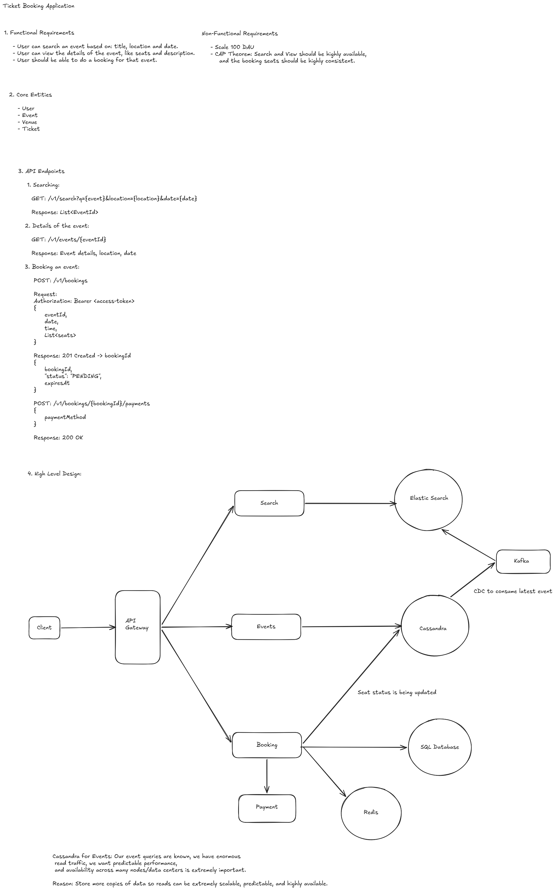

# System Design of Movie Ticket Application


---
<p align="center">
  
</p>

---

## 1. Functional Requirements

The system supports three main operations:

-   Search for events by name, location, and date.
-   View event details.
-   Book seats and complete payment.

The system is designed for **500M DAU** and is read-heavy for event
discovery and event details.

------------------------------------------------------------------------

## 2. Non-Functional Requirements

### Scalability

The system must support very high read traffic because the application
has 500M DAU. Search, event viewing, and booking are separated so that
each workload can be scaled independently.

### Availability

Search and event details require high availability. Cassandra is used
for event data because the query patterns are known and Cassandra
supports horizontal scaling and replication across nodes/data centers.

### Consistency

Search is eventually consistent because Elasticsearch is updated
asynchronously from Cassandra.

Seat booking requires stronger consistency because two users must not
successfully reserve the same seat.

### Fault Tolerance

The system is designed so that failure of the search pipeline does not
remove the authoritative event data. Cassandra remains the persistent
event store, while Elasticsearch contains derived search data.

------------------------------------------------------------------------

# 3. Service Decomposition

The system is divided into three services:

  -----------------------------------------------------------------------
  Service                 Responsibility          Main Storage/System
  ----------------------- ----------------------- -----------------------
  Search Service          Search events by name,  Elasticsearch
                          location, and date      

  Event Service           Store and retrieve      Cassandra
                          event details           

  Booking Service         Reserve seats and       Redis + SQL database
                          create bookings         
  -----------------------------------------------------------------------

The services are separated because their workloads and consistency
requirements are different.

------------------------------------------------------------------------

# 4. Search Service

The Search Service is responsible for discovering events based on
flexible search criteria such as event name, location, and date.

Elasticsearch is used because the requirement is search-oriented. The
search operation needs indexes over the searchable fields rather than
the fixed query access patterns used by the Event Service.

The Search Service does not own the event data. It uses an Elasticsearch
representation of the event data.

``` text
Search Service
      |
      v
Elasticsearch
      |
      v
Matching Event IDs
```

### Search Service -\> Elasticsearch

  -----------------------------------------------------------------------------------------------------------------------
  From                    To                      Data
  ----------------------- ----------------------- -----------------------------------------------------------------------
  Search Service          Elasticsearch           `{ "name": "Avengers", "location": "Gurgaon", "date": "2026-08-15" }`

  -----------------------------------------------------------------------------------------------------------------------

------------------------------------------------------------------------

# 5. Event Service

The Event Service is responsible for retrieving event details.

The Event Service uses Cassandra because its queries are known in
advance and the system needs high-volume reads, horizontal scalability,
and high availability.

Cassandra is the persistent store for the Event Service. Elasticsearch
is not used as the source of truth for event data.

``` text
Event Service
      |
      v
Cassandra
```

### Event Service -\> Cassandra

  ------------------------------------------------------------------------------------------------------------------------------------------
  From                    To                      Data
  ----------------------- ----------------------- ------------------------------------------------------------------------------------------
  Event Service           Cassandra               `{ "eventId": "E123", "name": "Avengers", "location": "Gurgaon", "date": "2026-08-15" }`

  ------------------------------------------------------------------------------------------------------------------------------------------

### Cassandra -\> Event Service

  ------------------------------------------------------------------------------------------------------------------------------------------
  From                    To                      Data
  ----------------------- ----------------------- ------------------------------------------------------------------------------------------
  Cassandra               Event Service           `{ "eventId": "E123", "name": "Avengers", "location": "Gurgaon", "date": "2026-08-15" }`

  ------------------------------------------------------------------------------------------------------------------------------------------

------------------------------------------------------------------------

# 6. Why Both Cassandra and Elasticsearch Exist

Cassandra and Elasticsearch have different responsibilities.

Cassandra stores the persistent event data and is the source of truth
for the Event Service.

Elasticsearch stores a search-oriented representation of that data. It
is used to find matching events efficiently.

The separation is:

``` text
Cassandra       -> persistent event data
Elasticsearch   -> search index
```

The Event Service therefore remains useful even though Search uses
Elasticsearch. Search answers which events match a query, while Event
Service provides the event data from Cassandra.

------------------------------------------------------------------------

# 7. CDC Pipeline

CDC stands for **Change Data Capture**.

CDC captures changes made to Cassandra and sends those changes to the
search pipeline. The purpose is to keep Elasticsearch updated when event
data changes in Cassandra.

The flow is:

``` text
Cassandra
   |
  CDC
   |
 Kafka
   |
Search Indexer
   |
Elasticsearch
```

### Cassandra -\> CDC

  -----------------------------------------------------------------------------------------------------------------------------------------------------------------
  From                    To                      Data
  ----------------------- ----------------------- -----------------------------------------------------------------------------------------------------------------
  Cassandra               CDC                     `{ "operation": "INSERT", "eventId": "E123", "name": "Avengers", "location": "Gurgaon", "date": "2026-08-15" }`

  -----------------------------------------------------------------------------------------------------------------------------------------------------------------

### CDC -\> Kafka

  -----------------------------------------------------------------------------------------------------------------------------------------------------------------
  From                    To                      Data
  ----------------------- ----------------------- -----------------------------------------------------------------------------------------------------------------
  CDC                     Kafka                   `{ "operation": "INSERT", "eventId": "E123", "name": "Avengers", "location": "Gurgaon", "date": "2026-08-15" }`

  -----------------------------------------------------------------------------------------------------------------------------------------------------------------

### Kafka -\> Search Indexer

  -----------------------------------------------------------------------------------------------------------------------------------------------------------------
  From                    To                      Data
  ----------------------- ----------------------- -----------------------------------------------------------------------------------------------------------------
  Kafka                   Search Indexer          `{ "operation": "INSERT", "eventId": "E123", "name": "Avengers", "location": "Gurgaon", "date": "2026-08-15" }`

  -----------------------------------------------------------------------------------------------------------------------------------------------------------------

### Search Indexer -\> Elasticsearch

  ------------------------------------------------------------------------------------------------------------------------------------------
  From                    To                      Data
  ----------------------- ----------------------- ------------------------------------------------------------------------------------------
  Search Indexer          Elasticsearch           `{ "eventId": "E123", "name": "Avengers", "location": "Gurgaon", "date": "2026-08-15" }`

  ------------------------------------------------------------------------------------------------------------------------------------------

The Search Indexer transforms the database change into the document
structure used by Elasticsearch.

------------------------------------------------------------------------

# 8. Why CDC Is Used

Without CDC, the application would need to write the event to Cassandra
and Elasticsearch separately.

That creates a dual-write problem:

``` text
Application
   |
   +----> Cassandra
   |
   +----> Elasticsearch
```

One write could succeed while the other fails.

With CDC, the application writes the event to Cassandra, and the change
is propagated asynchronously:

``` text
Application
    |
    v
Cassandra
    |
   CDC
    |
    v
Kafka
    |
    v
Elasticsearch
```

This makes Cassandra the source of truth and Elasticsearch a derived
search index.

The tradeoff is eventual consistency. A newly created event can exist in
Cassandra before it becomes visible in Elasticsearch.

------------------------------------------------------------------------

# 9. CDC Failure Handling

CDC can fail, so the pipeline must retain its processing position and
resume from that position after recovery.

If CDC is temporarily unavailable, Cassandra still contains the event
data. Elasticsearch can temporarily become stale, meaning some newly
created events may not appear in search.

The important property is that the event is not lost from the source
database.

``` text
Cassandra
   |
   X
  CDC failure
   |
   v
CDC restarts
   |
   v
Continue processing changes
```

CDC lag is therefore relevant to search freshness.

------------------------------------------------------------------------

# 10. Kafka

Kafka sits between CDC and the Search Indexer.

Its role is to carry and retain the change events so that the Search
Indexer can process them asynchronously.

``` text
CDC
 |
 v
Kafka
 |
 v
Search Indexer
```

### Kafka -\> Search Indexer

  ----------------------------------------------------------------------------------------------------------------------
  From                    To                      Data
  ----------------------- ----------------------- ----------------------------------------------------------------------
  Kafka                   Search Indexer          `{ "eventId": "E123", "operation": "UPDATE", "date": "2026-08-15" }`

  ----------------------------------------------------------------------------------------------------------------------

Kafka is also replicated across its cluster, so failure of an individual
Kafka broker does not remove the complete change stream.

------------------------------------------------------------------------

# 11. Elasticsearch Failure

Elasticsearch is a derived system, so its failure does not remove the
event data stored in Cassandra.

If Elasticsearch becomes unavailable, the search index cannot be updated
or queried normally. The changes remain in the pipeline and can be
processed after Elasticsearch becomes available.

If Elasticsearch data is missing, it can be rebuilt from Cassandra
because Cassandra contains the event data.

``` text
Cassandra
   |
   v
CDC
   |
   v
Kafka
   |
   v
Search Indexer
   |
   v
Elasticsearch
```

The important relationship is:

``` text
Cassandra -> source of truth
Elasticsearch -> derived search data
```

------------------------------------------------------------------------

# 12. Booking Service

The Booking Service is responsible for seat reservation and booking.

Booking has a stronger consistency requirement than search because the
same seat must not be successfully reserved by two users.

The booking flow first creates a temporary reservation in Redis.

``` text
Booking Service
      |
      v
Redis
      |
      v
Payment
      |
      v
SQL Database
```

------------------------------------------------------------------------

# 13. Temporary Seat Reservation

When a user selects a seat, the Booking Service attempts to create a
Redis key with a **10-minute TTL**.

The reservation uses an atomic conditional write:

``` text
SET seat_key booking_id NX EX 600
```

`NX` means the key is created only when it does not already exist.

`EX 600` gives the reservation a 10-minute lifetime.

### Booking Service -\> Redis

  --------------------------------------------------------------------------------------------------
  From                    To                      Data
  ----------------------- ----------------------- --------------------------------------------------
  Booking Service         Redis                   `SET seat:{event_123}:A10 booking_789 NX EX 600`

  --------------------------------------------------------------------------------------------------

If two users select the same seat, both requests may reach Redis at
nearly the same time, but only one `SET NX` operation can successfully
create the key.

The other request fails because the key already exists.

------------------------------------------------------------------------

# 14. Redis Cluster

Redis is deployed as a cluster.

A seat has a canonical key based on the event and seat:

``` text
seat:{event_123}:A10
```

Redis Cluster maps the key to a hash slot, and the slot is owned by a
Redis node.

Therefore, two users attempting to reserve the same seat are competing
for the same Redis key rather than creating independent copies of the
seat on different Redis nodes.

### Booking Service -\> Redis Cluster

  --------------------------------------------------------------------------------------------------
  From                    To                      Data
  ----------------------- ----------------------- --------------------------------------------------
  Booking Service         Redis Cluster           `SET seat:{event_123}:A10 booking_789 NX EX 600`

  --------------------------------------------------------------------------------------------------

------------------------------------------------------------------------

# 15. Multiple Seat Reservation

When multiple seats are selected, the seats use the same event hash tag:

``` text
seat:{event_123}:A10
seat:{event_123}:A11
seat:{event_123}:A12
```

The common `{event_123}` portion keeps the related keys in the same
Redis hash slot.

This allows the selected seats to be handled together when an atomic
multi-key reservation is required.

The reason is to prevent partial reservations where some requested seats
are reserved and another requested seat is already taken.

------------------------------------------------------------------------

# 16. Payment and Durable Booking

The Redis reservation is temporary. It is not the permanent booking
record.

The booking initially has a pending state while the user completes
payment.

``` text
Seat selected
     |
     v
Redis hold
     |
     | 10 minute TTL
     |
     v
Payment
     |
     v
SQL Database
```

After successful payment, the booking and seat state are persisted in
the SQL database.

If payment is not completed and the Redis TTL expires, the temporary
reservation disappears and the seat can be reserved again.

### Booking Service -\> SQL Database

  ----------------------------------------------------------------------------------------------------------------------------------------------
  From                    To                      Data
  ----------------------- ----------------------- ----------------------------------------------------------------------------------------------
  Booking Service         SQL Database            `{ "bookingId": "B789", "eventId": "E123", "seats": ["A10", "A11"], "status": "CONFIRMED" }`

  ----------------------------------------------------------------------------------------------------------------------------------------------

------------------------------------------------------------------------

# 17. Booking State

The booking has two important stages:

``` text
PENDING
   |
   | payment succeeds
   v
CONFIRMED
```

The Redis entry represents the temporary reservation during the
`PENDING` stage.

The SQL database represents the durable booking after successful
payment.

------------------------------------------------------------------------

# 18. Consistency Model

Different parts of the system use different consistency requirements.

  Operation                    System          Consistency
  ---------------------------- --------------- -----------------------
  Event search                 Elasticsearch   Eventual consistency
  Event details                Cassandra       Persistent event data
  Temporary seat reservation   Redis           Atomic reservation
  Confirmed booking            SQL Database    Durable booking state

Search can tolerate a small delay between Cassandra and Elasticsearch
because the purpose is event discovery.

Seat reservation cannot use the same eventual-consistency model because
two users must not successfully acquire the same seat.

------------------------------------------------------------------------

# 19. Component Responsibilities

  -----------------------------------------------------------------------
  Component                           Responsibility
  ----------------------------------- -----------------------------------
  Search Service                      Search events by name, location,
                                      and date

  Elasticsearch                       Maintain searchable event
                                      representation

  Event Service                       Retrieve event details

  Cassandra                           Persist event data and provide
                                      highly available scalable reads

  CDC                                 Capture changes from Cassandra

  Kafka                               Carry and retain change events

  Search Indexer                      Convert change events into
                                      Elasticsearch documents

  Booking Service                     Reserve seats and manage booking
                                      flow

  Redis                               Temporarily reserve seats for 10
                                      minutes

  SQL Database                        Persist confirmed booking and seat
                                      state

  Payment                             Process the user's payment
  -----------------------------------------------------------------------

------------------------------------------------------------------------

# 20. End-to-End Data Flow

## Event Creation

``` text
Event Service
    |
    v
Cassandra
    |
    v
CDC
    |
    v
Kafka
    |
    v
Search Indexer
    |
    v
Elasticsearch
```

### Data Passed Between Components

  --------------------------------------------------------------------------------------------------------------------
  From                    To                      Example
  ----------------------- ----------------------- --------------------------------------------------------------------
  Event Service           Cassandra               `{ "eventId": "E123", "name": "Avengers", "location": "Gurgaon" }`

  Cassandra               CDC                     `{ "operation": "INSERT", "eventId": "E123" }`

  CDC                     Kafka                   `{ "operation": "INSERT", "eventId": "E123" }`

  Kafka                   Search Indexer          `{ "operation": "INSERT", "eventId": "E123" }`

  Search Indexer          Elasticsearch           `{ "eventId": "E123", "name": "Avengers", "location": "Gurgaon" }`
  --------------------------------------------------------------------------------------------------------------------

## Event Search

``` text
Client
  |
  v
Search Service
  |
  v
Elasticsearch
  |
  v
Event IDs
```

## Event Details

``` text
Client
  |
  v
Event Service
  |
  v
Cassandra
  |
  v
Event Details
```

## Seat Booking

``` text
Client
  |
  v
Booking Service
  |
  v
Redis
  |
  v
Payment
  |
  v
SQL Database
```

------------------------------------------------------------------------

# 21. Main Design Decisions

### Search Service + Elasticsearch

Search requires finding events by name, location, and date.
Elasticsearch is used because it is designed for search-oriented
queries.

### Event Service + Cassandra

Event data has known query patterns and high read volume. Cassandra is
used for scalable and highly available persistent storage.

### Cassandra + CDC + Kafka + Elasticsearch

Cassandra is the source of truth. CDC captures changes, Kafka carries
them, and the Search Indexer updates Elasticsearch. This creates an
asynchronous search projection and avoids making Cassandra and
Elasticsearch a synchronous dual-write operation.

### Booking Service + Redis

Seat reservation is concurrency-sensitive. Redis provides an atomic
`SET NX` operation and a 10-minute TTL for temporary reservations.

### Booking + SQL Database

The temporary Redis reservation is not the durable booking. After
successful payment, the confirmed booking and seat state are persisted
in the SQL database.

------------------------------------------------------------------------

# 22. Overall Design

The system has three separate responsibilities:

  Responsibility              Service           Main System
  --------------------------- ----------------- ----------------------
  Find events                 Search Service    Elasticsearch
  Store and retrieve events   Event Service     Cassandra
  Reserve and book seats      Booking Service   Redis + SQL Database

The main design principle is to use each storage system according to the
consistency and access pattern required by its responsibility:

-   **Elasticsearch** for event discovery.
-   **Cassandra** for persistent event data and high-volume reads.
-   **Redis** for short-lived atomic seat reservations.
-   **SQL database** for durable confirmed bookings.
-   **CDC + Kafka** to asynchronously propagate event changes from
    Cassandra to Elasticsearch.
