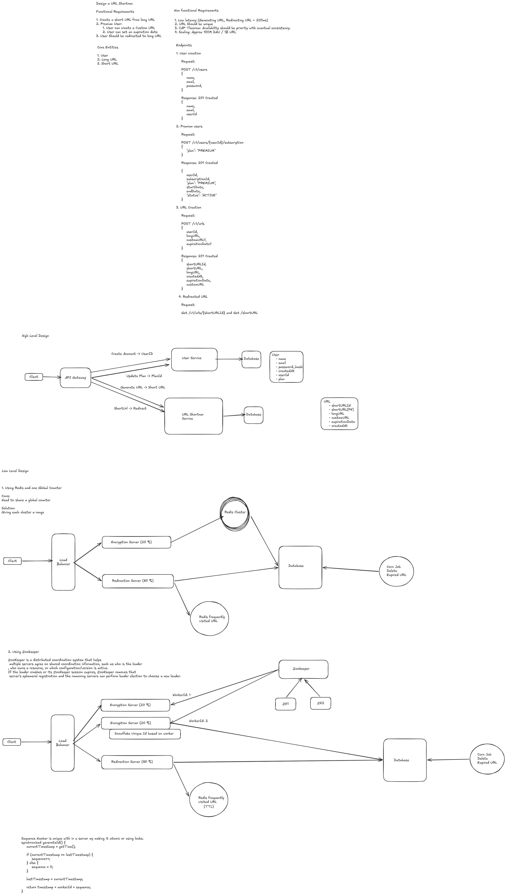

# URL Shortener HLD --- Reasoning, Trade-offs, and Decisions

This document captures the reasoning behind the URL shortener design,
not just the final boxes and arrows. The goal is to explain why each
component was introduced, what problem it solves, what alternatives were
considered, and what trade-off was accepted.

---

  

---

## 1. Problem We Are Solving

The basic problem is simple: a user gives us a long URL and we generate
a short URL. When someone opens the short URL, the system must quickly
find the original long URL and redirect the user to it.

The system also needs a user/account concept because some features are
restricted to premium users. A normal user can create a short URL, while
a premium user can additionally choose a custom short URL and an
expiration date.

The important thing is that the redirect path is much more
latency-sensitive than most other operations. Creating a URL happens
relatively rarely compared with people clicking shared short URLs.
Therefore, the architecture should be designed around making URL lookup
and redirection extremely fast.

------------------------------------------------------------------------

# 2. Functional Requirements

The first requirement is URL creation. A user sends a long URL and the
system returns a short URL.

The second requirement is premium functionality. Premium users can
provide a custom URL/alias and can specify an expiration date. This
means the system needs some representation of the user's plan and also
needs to validate whether the requested operation is allowed for that
user.

The third requirement is redirection. When somebody opens a short URL,
the system must resolve the short identifier to the original long URL
and redirect the client.

These requirements naturally lead to three main concepts: User,
Subscription/Plan, and URL.

------------------------------------------------------------------------

# 3. Non-Functional Requirements

The first major non-functional requirement is low latency. The target
written in the design is around 200 ms for URL generation and
redirection. In practice, the redirect path should be optimized even
further because it is the most frequently executed operation.

The second requirement is uniqueness. Two different URLs must not
accidentally receive the same short identifier. If a custom alias is
requested, that alias must also be unique.

The third requirement is availability with eventual consistency. The
design explicitly gives availability priority under the CAP trade-off.
This is reasonable for a large URL shortener because the system is
expected to continue serving redirects even when some replicas are
temporarily out of sync. Some secondary information can become
consistent shortly afterward, while the core redirect operation should
remain available.

The fourth requirement is scale. The target in the design is
approximately 100 million daily active users and around 1 billion URLs.
At this scale, a single application server and a single database are not
sufficient. The design therefore needs horizontal scaling, caching, and
a way to generate unique identifiers without depending on one central
application server.

------------------------------------------------------------------------

# 4. Why the System Is Split Into Two Services

The design separates User Service and URL Shortener Service.

The User Service owns user-related information such as user ID, email,
password hash, creation time, and plan/subscription information. Its
responsibility is account management rather than URL resolution.

The URL Shortener Service owns URL-related information such as short URL
ID, short URL, long URL, custom alias, expiration time, and creation
time. This service is responsible for generating short URLs and
resolving them during redirects.

This separation is useful because the two workloads are very different.
User management is relatively low-volume compared with URL redirection.
URL redirection can receive enormous read traffic. Keeping the URL
workload independent means the redirect infrastructure can scale without
scaling the user-management infrastructure unnecessarily.

------------------------------------------------------------------------

# 5. API Gateway

The client first reaches an API Gateway. The gateway provides a common
entry point for the backend services and can perform concerns such as
routing, authentication checks, rate limiting, and load balancing.

The gateway then routes user-related requests to User Service and
URL-related requests to URL Shortener Service.

The important design point is that the gateway does not own the business
data. User data remains owned by User Service, and URL data remains
owned by URL Shortener Service.

------------------------------------------------------------------------

# 6. User Creation API

The proposed endpoint is:

POST /v1/users

Request:

{ "name": "John", "email": "john@example.com", "password": "..." }

Response:

201 Created

{ "name": "John", "email": "john@example.com", "userId": "..." }

The client provides the password, but the service must never store the
raw password. The User Service hashes the password and stores
password_hash in the User database.

The user ID is generated by the service and becomes the stable
identifier for that account.

------------------------------------------------------------------------

# 7. Premium Subscription API

The design treats premium as a subscription/plan rather than simply
making the client send premium=true during user creation.

The endpoint is:

POST /v1/users/{userId}/subscription

Request:

{ "plan": "PREMIUM" }

Response:

201 Created

{ "userId": "...", "subscriptionId": "...", "plan": "PREMIUM",
"startDate": "...", "endDate": "...", "status": "ACTIVE" }

The reasoning is that becoming premium is a new business event that
happens after the user already exists. It is therefore better
represented as creating a subscription than as creating the user again
or simply modifying the user creation request.

This also gives the design room for future subscription concepts such as
start date, end date, cancellation, renewal, multiple plans, and
subscription status.

For a very simple implementation, plan information can also exist on the
User record. But if subscriptions have their own lifecycle, a separate
Subscription entity is cleaner.

------------------------------------------------------------------------

# 8. URL Creation API

The proposed endpoint is:

POST /v1/urls

Request:

{ "userId": "...", "longURL": "https://example.com/a/very/long/path",
"customURL": "...", "expirationDate": "..." }

The optional fields are important. customURL and expirationDate are only
meaningful when the user's plan allows those features.

The service should validate the user and determine whether the user is
premium before accepting premium-only fields. The client should not be
trusted simply because it sends a premium flag.

Response:

201 Created

{ "shortURLId": "...", "shortURL": "...", "longURL": "...", "createdAt":
"...", "expirationDate": "...", "customURL": "..." }

The URL Shortener Service stores the URL mapping and returns the
generated short URL.

------------------------------------------------------------------------

# 9. Redirect API

There are effectively two different GET use cases.

The public short URL is used for redirection:

GET /{shortURL}

For example:

GET /abc123

The service looks up abc123, finds the original long URL, and returns a
redirect response such as:

302 Found Location: https://example.com/very/long/url

A separate API such as:

GET /v1/urls/{shortURLId}

can be used when the client needs URL metadata rather than a browser
redirect.

Keeping these two concepts separate prevents the API used for metadata
retrieval from being confused with the actual high-volume redirect path.

------------------------------------------------------------------------

# 10. Core Data Model

The main User record contains:

-   userId
-   name
-   email
-   password_hash
-   createdAt
-   plan

The URL record contains:

-   shortURLId
-   shortURL
-   longURL
-   customURL
-   expirationDate
-   createdAt

The short URL or alias must be uniquely indexed. The custom alias also
needs uniqueness if it is supported.

The URL record should contain the userId that created it so that
ownership can be established without putting all URL data inside the
User Service database.

------------------------------------------------------------------------

# 11. Why the URL Service Stores userId

The URL Service needs to know who owns a URL, but it does not need to
copy the complete user record.

Therefore the URL record can contain:

userId -\> owner of the URL

This is a reference, not a reason for the URL Service to directly depend
on the User database for every redirect.

This distinction is especially important for the redirect path. If every
click required a remote call to User Service, the redirect path would
become slower and more fragile. A redirect should mainly need the short
URL mapping.

------------------------------------------------------------------------

# 12. High-Level Request Flow

For URL creation:

Client -\> API Gateway -\> URL Shortener Service -\> URL Database

For user creation:

Client -\> API Gateway -\> User Service -\> User Database

For premium subscription:

Client -\> API Gateway -\> User Service -\> User/Subscription Database

For redirection:

Client -\> Load Balancer -\> Redirection Servers -\> Cache/Database -\>
302 Redirect

The last path is deliberately optimized differently from normal API
operations because it is the highest-volume path.

------------------------------------------------------------------------

# 13. Why We Need Separate Encryption/Generation and Redirection Capacity

The diagram allocates approximately 20% capacity to the URL-generation
side and approximately 80% to the redirection side.

The exact percentage is not a fixed truth; it is an architectural
assumption based on the workload. A short URL may be generated once but
clicked many times. Therefore, redirect traffic can be orders of
magnitude larger than creation traffic.

The practical decision is to scale the redirection layer independently.
If traffic later shows that the ratio is different, the allocation can
be changed. The important decision is independent scalability rather
than the exact 20/80 number.

The diagram labels the creation component as an "Encryption Server". In
a URL shortener, this role is more accurately thought of as the URL
generation/encoding side. It generates the short identifier rather than
encrypting the long URL in the conventional cryptographic sense.

------------------------------------------------------------------------

# 14. Why Redis Is Used

Redis is introduced primarily because URL redirection is read-heavy.

Suppose a popular short URL is:

abc123 -\> https://example.com/article

If thousands or millions of users request abc123, reading the database
for every request creates unnecessary database load.

Instead:

GET abc123 \| v Redis \| +-- hit -\> long URL \| +-- miss -\> Database
-\> Redis -\> long URL

This makes frequently accessed URLs much faster to resolve and protects
the database from a huge number of repeated reads.

The cache should contain the mapping required by the redirect path, not
necessarily the entire URL database.

------------------------------------------------------------------------

# 15. Cache Strategy

The design uses Redis as a frequently-accessed URL cache.

A cache hit is the ideal path:

Client -\> Redirection Server -\> Redis -\> Redirect

A cache miss becomes:

Client -\> Redirection Server -\> Redis miss -\> Database -\> Redis -\>
Redirect

The database remains the source of durable truth, while Redis is the
fast-access layer.

This distinction is important. Redis should not be treated as the only
permanent storage for URLs unless the system explicitly accepts that
durability model.

------------------------------------------------------------------------

# 16. Expiration Handling

Premium users can specify an expiration date.

There are two related mechanisms in the design.

First, the URL can have expiration information in the database. This is
the durable business state.

Second, Redis can use TTL so that an expired URL is automatically
removed from the cache.

A background job/cron job is also shown for deleting expired URLs from
the database.

The reason for having both is that cache expiration and database cleanup
solve different problems. Redis TTL prevents stale cache entries from
being served, while the background job removes expired records from
durable storage.

The background cleanup does not need to execute at the exact second an
URL expires. The redirect path should still check expiration when
necessary. The cleanup job is mainly for storage hygiene.

------------------------------------------------------------------------

# 17. Why a Background Job Is Needed

Expired URLs should not remain forever in the database.

A scheduled job can periodically find expired records and delete or
archive them.

This is intentionally asynchronous. Making the user wait for cleanup
during a normal redirect would add unnecessary latency.

The redirect path should be optimized for serving requests, while
cleanup can happen in the background.

------------------------------------------------------------------------

# 18. First Approach for Short ID Generation: Redis Global Counter

The first idea considered was a Redis global counter.

The basic idea is:

INCR global_counter

The returned number can then be converted into a short representation.

This has one very useful property: Redis INCR is atomic. Multiple
servers can increment the same counter without generating the same
number.

However, the major problem is that every URL creation depends on one
shared global counter.

At very large scale, that creates a centralized coordination point. Even
if Redis itself is fast, the architecture is still making all
ID-generation workers depend on the same logical counter.

This becomes a scalability and availability concern, especially when the
system is expected to operate across multiple clusters or regions.

------------------------------------------------------------------------

# 19. Improvement to the Redis Counter Approach: Allocate Ranges

A better version of the Redis counter idea is to allocate ranges of IDs
to different workers.

For example:

Worker 1 gets 1 to 1,000,000. Worker 2 gets 1,000,001 to 2,000,000.

Each worker can then generate IDs locally until its range is exhausted.

This reduces the frequency of communication with the global counter.

The trade-off is that the allocation mechanism is still centralized at
range-allocation time, and the system must manage unused ranges. If a
worker crashes halfway through its range, some IDs may remain unused.

Unused IDs are acceptable because uniqueness is more important than
perfectly sequential IDs.

------------------------------------------------------------------------

# 20. Second Approach: ZooKeeper Coordination

The next approach considered was ZooKeeper.

ZooKeeper is a distributed coordination system. It can be used when
multiple servers need to agree on shared coordination state, such as
leader election or ownership of a resource.

The design considers using ZooKeeper to coordinate workers and their
IDs.

A benefit is that ZooKeeper can manage distributed coordination and
detect worker failures through sessions/ephemeral registrations. If a
leader or worker disappears, other workers can detect that and continue
coordination.

However, this is more infrastructure than is necessary for a simple
ID-generation problem. Introducing ZooKeeper means operating another
distributed system and dealing with its operational complexity.

The system does not actually need a leader to generate every URL ID. It
needs globally unique IDs with very low coordination cost.

That led to the next approach.

------------------------------------------------------------------------

# 21. Final ID Generation Direction: Snowflake-Style IDs

The final direction shown in the design is a Snowflake-style ID based on
worker ID.

The key idea is that each server has a unique worker ID. The generated
ID combines:

timestamp + workerId + sequence

This means different workers can generate IDs independently without
asking one central server for every ID.

For example:

Worker 1:

timestamp \| workerId=1 \| sequence

Worker 2:

timestamp \| workerId=2 \| sequence

Even if both workers generate an ID during the same millisecond, their
worker IDs make the resulting IDs different.

This is a much better fit for a horizontally scaled URL shortener
because ID generation becomes mostly local.

------------------------------------------------------------------------

# 22. Why the Sequence Number Must Be Atomic

A worker can receive concurrent URL-creation requests.

Suppose two threads on the same worker see the same timestamp.

If both execute:

sequence++

without synchronization, they can race with each other and potentially
produce duplicate or incorrect sequence values.

Therefore, the sequence number must be protected by an atomic operation,
lock, or another concurrency mechanism.

The basic logic shown in the design is:

if currentTimestamp == lastTimestamp: sequence++ else: sequence = 0

lastTimestamp = currentTimestamp

return timestamp + workerId + sequence

The exact implementation should also handle sequence overflow and clock
movement.

------------------------------------------------------------------------

# 23. Why Worker ID Is Important

The sequence number only needs to be unique inside one worker for a
given timestamp.

Worker 1 can generate:

timestamp + worker1 + sequence5

Worker 2 can generate:

timestamp + worker2 + sequence5

The sequence number being equal is not a problem because the worker IDs
are different.

This removes the need for a globally shared sequence counter for every
request.

The system therefore scales by adding workers instead of making every
worker coordinate through a single counter.

------------------------------------------------------------------------

# 24. Clock and Snowflake Trade-offs

A Snowflake-style generator depends on time.

If the machine clock moves backward, generated IDs can potentially
become problematic.

A production implementation therefore needs a clock-backward strategy,
such as waiting until the clock catches up, using a logical timestamp,
or failing safely depending on the design.

This is a trade-off accepted in exchange for avoiding centralized ID
generation.

The main point is that Snowflake is not magic. It moves the complexity
from global coordination to worker identity, sequence management, and
clock handling.

------------------------------------------------------------------------

# 25. Short URL Encoding

A Snowflake ID itself is not necessarily a short string suitable for a
URL.

Therefore, after generating the unique numeric ID, it can be encoded
into a compact representation such as Base62.

Base62 uses:

0-9 A-Z a-z

This gives a compact string representation.

For example:

numeric ID -\> Base62 -\> abc123

The exact generated value does not matter as long as the mapping is
unique and the resulting string is acceptable as a URL path.

Custom aliases are different. They are user-selected strings and
therefore require an explicit uniqueness check.

------------------------------------------------------------------------

# 26. Why We Do Not Need Sequential Short URLs

There is no business requirement that short URLs must be perfectly
sequential.

The requirement is uniqueness and low latency.

Therefore:

100001 100002 100003

is not more valuable than:

847293847 847293848

if both can be encoded into an acceptable short representation.

Trying to maintain a perfectly sequential global counter would introduce
unnecessary coordination.

------------------------------------------------------------------------

# 27. Custom URL Handling

A premium user can request:

POST /v1/urls

{ "longURL": "https://example.com", "customURL": "my-link" }

The service must check whether my-link is already taken.

The database should enforce uniqueness as well. An application-level
check alone is not sufficient because two requests can arrive
concurrently:

Request A -\> check my-link -\> available Request B -\> check my-link
-\> available

Both could then attempt insertion.

A unique database constraint is the final protection against this race.

If the second insert fails because the alias already exists, the service
can return a conflict response such as 409 Conflict.

------------------------------------------------------------------------

# 28. Why Database Constraints Matter

The same principle applies to email addresses and short URLs.

Application logic can check:

SELECT ... WHERE shortURL = ?

but that check is not atomic with the later INSERT.

The database should therefore enforce:

UNIQUE(shortURL)

and, where appropriate:

UNIQUE(email) UNIQUE(customURL)

The application provides a friendly validation path, while the database
provides the final correctness guarantee.

------------------------------------------------------------------------

# 29. Redirect Path Optimization

The redirect path is the most important path in the system.

The ideal flow is:

Client \| Load Balancer \| Redirection Server \| Redis \| 302 Redirect

The database should not be involved for every request.

If Redis misses:

Redirection Server \| Redis miss \| Database \| Store in Redis \|
Redirect

This is why the architecture gives a larger amount of capacity to
redirection servers.

------------------------------------------------------------------------

# 30. Load Balancing

The load balancer distributes incoming traffic across multiple
URL-generation and redirection servers.

The services should be stateless wherever possible. If one redirection
server fails, another server should be able to process the request.

This allows horizontal scaling:

one server -\> two servers -\> hundreds of servers

without requiring the client to know which server handles a request.

The shared state belongs in databases, Redis, or other dedicated
infrastructure rather than in an individual application server's memory.

------------------------------------------------------------------------

# 31. Why Redis Is Shared Across Redirection Servers

Imagine three redirection servers:

Server 1 Server 2 Server 3

If each server had its own local cache, a popular URL might be stored
separately in all three caches. A request routed to a different server
could then miss its local cache.

A shared Redis cluster allows all redirection servers to access the same
cache.

This improves cache effectiveness and makes scaling the redirection
servers easier.

------------------------------------------------------------------------

# 32. Availability vs Consistency

The design chooses availability as the priority.

For example, if a URL is created and the system has multiple replicas,
one replica might receive the new data slightly later.

That temporary inconsistency is acceptable as long as the system
converges and the core service remains available.

However, not every operation should blindly accept eventual consistency.
Things such as custom alias uniqueness need stronger correctness at the
point of creation.

Therefore, the design can use eventual consistency for
replicated/read-heavy paths while still relying on a strongly consistent
database constraint for uniqueness.

This is an important distinction: choosing availability does not mean
ignoring correctness.

------------------------------------------------------------------------

# 33. Failure Scenario: Redis Is Down

Redis is a cache, not the permanent source of truth.

If Redis becomes unavailable, the system can fall back to the database,
assuming the database remains available.

The downside is higher latency and higher database load.

This is a deliberate trade-off. The system loses some performance but
should still be able to serve URLs.

For very high scale, the system may use Redis
replication/sentinel/cluster mechanisms to reduce the chance of a
complete cache outage.

------------------------------------------------------------------------

# 34. Failure Scenario: One Redirection Server Fails

Because redirection servers are stateless and sit behind a load
balancer, a failed server should not cause the entire redirect service
to fail.

The load balancer removes unhealthy instances from rotation and sends
traffic to healthy instances.

This is another reason not to store important URL state only in
application memory.

------------------------------------------------------------------------

# 35. Failure Scenario: Database Is Temporarily Unavailable

If Redis contains the requested URL, a redirect can potentially continue
without touching the database.

This is one of the strongest reasons for caching popular URLs.

For a cache miss, however, the system depends on the database.
Therefore, database replication and high availability become important
at production scale.

The exact database technology is a separate decision from the service
architecture and should be selected based on the expected access
pattern, consistency needs, storage size, and operational requirements.

------------------------------------------------------------------------

# 36. Expired URL During Redirect

A cached URL can have a TTL based on its expiration date.

However, the application should not assume that cache expiration alone
is the complete business rule.

The durable record contains expirationDate. If the URL is expired, the
redirect should not continue to the original destination.

The system can return an appropriate response such as 404 Not Found or
410 Gone depending on the chosen API semantics.

The cleanup job can later remove the expired record from the database.

------------------------------------------------------------------------

# 37. Premium Authorization

Premium functionality should be enforced by the backend.

For example, a normal user should not be able to send:

{ "customURL": "special-link" }

and automatically receive a premium feature.

The URL Shortener Service needs a trusted way to determine the user's
plan.

At scale, repeatedly calling User Service during every URL creation can
introduce coupling and latency. A practical design can use authenticated
user information, a subscription/plan cache, or an appropriate internal
service call on the relatively low-volume creation path.

The redirect path should not need to perform this premium check.

------------------------------------------------------------------------

# 38. Why POST Is Used for URL Creation

URL creation creates a new resource, so POST is appropriate:

POST /v1/urls

The long URL is request data, so it belongs in the request body rather
than being placed directly in the path.

Using:

POST /v1/url/{longURL}

would make the URL awkward to encode because a long URL itself contains
characters such as ?, &, /, and =.

The body is therefore cleaner and more extensible.

------------------------------------------------------------------------

# 39. Why Subscription Uses POST

Creating a subscription is also a resource-creation operation.

Therefore:

POST /v1/users/{userId}/subscription

is appropriate when the request means "create a subscription".

If the business later becomes a simple state update such as changing a
user's plan field, PATCH could be appropriate. The chosen endpoint
reflects the decision that premium is modeled as a subscription with its
own lifecycle.

------------------------------------------------------------------------

# 40. Why Redirect Uses GET

Opening a short URL is a read operation from the client's perspective.

Therefore:

GET /abc123

is natural.

The server does not modify the short URL itself. It resolves the
identifier and returns a redirect.

If analytics are recorded, those writes should ideally be handled
asynchronously or in a way that does not significantly slow the redirect
response.

------------------------------------------------------------------------

# 41. Core Architecture

The resulting architecture is approximately:

Client \| API Gateway / Load Balancer \| +------------------------+ \|
\| v v User Service URL Shortener Service \| \| User DB URL DB \| Redis
\| Redirection Servers

The exact deployment can use separate load balancers or routing rules,
but the logical separation remains the same.

------------------------------------------------------------------------

# 42. Main Design Decisions

The major decisions made during the design are:

1.  Separate User Service from URL Shortener Service.
2.  Keep user data and URL data in separate logical databases.
3.  Model premium as a subscription when it has its own lifecycle.
4.  Use POST for creating users, subscriptions, and URLs.
5.  Use GET for the public short URL redirect.
6.  Use Redis as a high-speed URL cache.
7.  Use TTL for cached expiration handling.
8.  Use a background job for durable expired-URL cleanup.
9.  Give the redirection path more capacity because reads/clicks
    dominate creation.
10. Avoid a single global counter for every ID-generation request.
11. Considered Redis global counter with range allocation.
12. Considered ZooKeeper for distributed coordination.
13. Prefer a Snowflake-style worker-based ID generator to avoid
    per-request central coordination.
14. Protect the per-worker sequence with atomicity/locking.
15. Encode the generated ID into a compact representation such as
    Base62.
16. Enforce uniqueness at the database level.
17. Prefer availability and eventual consistency for
    distributed/read-heavy paths while preserving strong correctness
    where uniqueness requires it.

------------------------------------------------------------------------

# 43. Important Trade-offs

## Redis Global Counter vs Snowflake

A Redis global counter is simple and easy to understand. Redis INCR
gives atomic increments, which makes uniqueness straightforward.

The downside is centralized coordination. Range allocation reduces the
number of Redis calls but adds range-management complexity.

Snowflake removes per-request central coordination and works naturally
with many workers. The downside is that the implementation must manage
worker IDs, sequence overflow, and clock issues.

For the expected scale, the design moves toward Snowflake because the
URL generator should scale horizontally without a global counter
becoming the bottleneck.

## ZooKeeper vs Snowflake

ZooKeeper is powerful when the problem is distributed coordination.

But generating unique IDs does not inherently require leader election.
Introducing ZooKeeper would add another distributed system and
operational dependency.

Snowflake solves the specific requirement more directly.

## Database Only vs Database + Redis

Using only the database is simpler, but every redirect would hit the
database.

Database plus Redis adds operational complexity but dramatically reduces
repeated database reads for popular URLs.

Because redirection is expected to dominate traffic, the cache is
justified.

## Cleanup Job vs Synchronous Deletion

Synchronous deletion during expiration would make every request
responsible for maintenance.

A background cleanup job keeps the request path fast and allows cleanup
to happen independently.

The trade-off is that expired rows can remain in storage temporarily,
which is acceptable if the redirect path correctly respects expiration.

------------------------------------------------------------------------

# 44. What I Would Clarify Before Calling This Production-Ready

The diagram gives a strong HLD direction, but a production design would
still need decisions around the exact database technology, database
sharding/partitioning, Redis cluster topology, replication, disaster
recovery, multi-region deployment, authentication mechanism, rate
limits, monitoring, metrics, tracing, alerting, abuse prevention, URL
safety checks, and analytics.

The 100M DAU and 1B URL numbers also need to be translated into actual
requests per second. Daily active users alone does not determine peak
traffic. For a URL shortener, the click-to-create ratio is especially
important because it determines how much traffic the redirect layer must
handle.

The 20% generation and 80% redirection split is therefore an initial
capacity assumption, not a guaranteed ratio.

------------------------------------------------------------------------

# 45. Final Mental Model

The simplest way to think about the final design is:

User Service answers: "Who is this user and what plan do they have?"

URL Shortener Service answers: "Which long URL belongs to this short
identifier?"

Redis answers: "Can I give you this mapping immediately without going to
the database?"

The database answers: "What is the durable source of truth?"

The ID generator answers: "How can many servers create unique
identifiers without asking one central server for every request?"

The load balancer answers: "Which healthy server should handle this
request?"

The background job answers: "Which expired data can be cleaned up
asynchronously?"

The entire design is driven by one central observation: URL creation is
relatively infrequent, while URL redirection can be extremely frequent.
Therefore, the architecture spends most of its effort making the
redirect path fast, horizontally scalable, and independent of
unnecessary service calls. 
