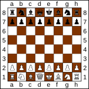

# Overview

Objective is to convert a vague business problem into a maintainable object-oriented design. Like when an interviewer says "Design a Chess Game", there can be many things like concurrent games, multiplayer, game rules, score, types of games, distributed design, etc., which we can't do all in a fixed time. For that purpose, we divide the process into multiple stages. Each stage is dedicated to one aspect and acts as a base for the next stages.

LLD pipeline:

Gathering Requirements → Use Cases (Who uses whom) → Entities → Relationships → Responsibilities → Classes → Interfaces → Design Patterns (If it is applicable) → Edge Cases → Code.

### Understanding the system

Some problems may contain new system which we are unaware of, for those the first priority is to get the understanding of system and what the system actually does.




## Stage 1 : Understanding Functional Requirements

This is the most important stage because every design decision comes from requirements. If requirements are wrong, everything else becomes wrong. It also helps us in discovering how a new system works if we are unaware of it. For example, if someone does not know about "Splitwise", they can get a high-level understanding and design the minimal required features.


Examples:

1. For Parking Lot:

```
Use cases become:

1. Vehicle enters
2. Ticket generated
3. Spot allocated
4. Vehicle exits
5. Payment calculated
6. Spot released
```

2. For BookMyShow:

```
Use cases become:

1. Search movie
2. Select show
3. Book seats
4. Pay
5. Cancel booking
```


### Gathering requirements


1. It is a standard chess, 8 * 8 size.
2. It should support Player vs Player.
3. Castling, Promotion (Expcept becoming King) are supported.
4. Notify all the spectators.
5. White should start first, after that alternate turns.
6. We must detect winner in Checkmate or draw the match.
7. The game contains normal Pieces with thier specific moves.
8. We should be able to view history at any stage after the game finishes.
9. Player can resign, and can undo/redo their moves.
10. Game can be saved and resumed.
11. We don't have timer for this system.
12. Pawn captures diagonally but does not support En Passant.
13. Check, Checkmate, Stalemate, Draw are supported.

## Stage 2 : Identify Actors and Use Cases

After understanding functionality, identify who interacts with the system and who is triggering those actions.

Example:

In a parking lot, a `Driver` enters parking and exits parking, and an `Admin` adds floors, and `Floors` add parking spots.

Before creating classes, we must first understand:

1. Who interacts with the system?
2. What actions can they perform?
3. What events happen in the system?
4. Which actor initiates each action?
5. Which actor receives information from the system?

Actors:

1. Player

  1. Start game
  2. Join game
  3. Make move
  4. Capture piece
  5. Castle
  6. Promote pawn
  7. Resign
  8. Undo move
  9. Redo move
  10. Save game
  11. Resume game
  12. View history

2. Spectator

  1. Watch game
  2. Receive move updates
  3. Receive check notifications
  4. Receive checkmate notifications
  5. Receive draw notifications
  6. Receive resignation notifications

3. System

  1. Check detection
  2. Checkmate detection
  3. Draw detection
  4. Stalemate detection
  5. Turn switching
  6. Spectator notification

Pieces?
```
Actors are external users of the system.
Pieces are part of the system itself.
They are entities, not actors.
```

## Stage 3 : Identifying Entities

Create entities that have meaningful state, behavior, lifecycle, or business importance.

Now, based on the functional requirements, we need to find core business objects, so we will take the requirements and highlight nouns. Two important things we need are: nouns and verbs. (`nouns`: A noun is a person, place, thing, concept, or object mentioned in the problem statement. `verbs`: Methods or behaviour)


Objective: `"Does the system need to remember information about this thing after we find nouns?"`

Like we have email address now are we storing `when it was created`, `who created`, `is it for biusness or child account`? If no, then it is not an entity.

Example:

In `"A customer can place an order. An order contains products. Payment is made for an order."`

Nouns:
1. Customer
2. Order
3. Products
4. Payment

Verbs:
1. Customer.placeOrder()
2. Order contains Product
3. Payment.payForOrder()

In `"A library manages books. Members borrow books and return them."`

Nouns:
1. Library
2. Books
3. Members

Verbs:
1. Library manages books
2. Member.borrowBooks()
3. Member.returnBooks()


Based on requirements we can have entities as:

1. ChessGame
2. Board
3. Player
4. Piece
5. Move
6. Spectator

Now, why move?
Because we have requirements as:

1. We should be able to view history after game finishes.
2. Undo/Redo moves.
3. Save and Resume.

As history is a collection of Move objects therefore no GameHistory.

Now what about color and game status?
No, since it is usually represented as enum.

### Note:
Not every noun becomes an entity. Some nouns are just attributes.

In `"A user has a name, email, and phone number."`

Nouns:
1. User

Attributes:
1. Name
2. Email
3. Phone Number

#### Not every noun should become a class.

1. Address might simply be a value object.
2. Status might be an enum.


## Stage 4 : Finding Relationships Between Entities

Now we need to think about how entities are connected with each other.
We must understand how entities depend on each other.

Now we want to know `How are these objects connected?` and `How strong is that connection"`

Example:

In Parking Lot:

```
Parking Lot contains Floor
Floor contains Spots
Spot holds Vehicle
Vehicle owns Ticket
Ticket has Payment
```

### Has-A Relationship

```
Car has Engine
Ticket has Payment
Show has Seats
```

### Is-A Relationship

```
Car is a Vehicle
Truck is a Vehicle
Bike is a Vehicle
```

For the relationship we must understand buisiness requirements:

1. Who owns whom?
2. Can child exist without parent?
3. What does the requirement naturally imply?


### Relationship 1

`ChessGame ↔ Board`

Every game requires exactly one board.
A board belongs to a game.
If game dies: Board dies too.

ChessGame 1 ---- 1 Board (Composition)


### Relationship 2

`ChessGame ↔ Player`

Each game requires two players.
Players can exist independently.

ChessGame 1 ---- 2 Players (Aggregation)

Players are not destroyed when game ends.
Lifecycle is independent.


### Relationship 3

`ChessGame ↔ Move`

Moves belong to a specific game.
Move #20 from Game A cannot suddenly belong to Game B.

ChessGame 1 ---- N Moves (Composition)


### Relationship 4

`ChessGame ↔ Spectator`

Spectators watch games.
A spectator can continue existing after game ends.
One spectator may watch multiple games.

Game N ---- M Spectators (Association)

### Relationship 5

`Board ↔ Piece`

If board is destroyed:
Piece state disappears.

Board 1 ---- N Pieces (Composition)


### Relationship 6

`Move ↔ Piece`

Move only references which piece moved.
Move stores reference/information.
No ownership.

Move 1 ---- 1 Piece (Association)


### Relationship 7

`Player ↔ Move`

One player makes many moves.
Each move belongs to one player.

Player 1 ---- N Moves (Association)


## Stage 5 : Assigning Responsibilities

Here we need to assign responsibility to the exact entities, as "who should own this responsibility".

Example:

Payment calculation:
Should Vehicle calculate payment? No. PaymentService should.

Objective: Which object is responsible for which piece of work? or Who should be responsible for this behavior?

A class should do things related to its own data.

For this we must know:

1. Who owns the data?
2. Who has enough information to perform the operation?
3. Who will be affected if the rule changes?

### Board:

1. Create 8×8 board structure.
2. Store current piece locations.
3. Place pieces during game setup.
4. Move pieces between positions.
5. Remove captured pieces.
6. Provide access to board positions.
7. Provide access to piece locations.
8. Check whether a square is occupied.
9. Check whether a square is empty.
10. Update board state after moves.
11. Support board restoration during undo.
12. Support board restoration during resume.
13. Provide board information for move validation.
14. Provide board information for check/checkmate calculations.

### Player:

1. Maintain player identity.
2. Maintain assigned color.
3. Participate in a match.
4. Initiate move requests.
5. Initiate undo requests.
6. Initiate redo requests.
7. Initiate resignation requests.
8. Initiate save requests.
9. Initiate history viewing requests.

### Piece:

1. Represent a chess piece.
2. Maintain piece color.
3. Maintain current position.
4. Define legal movement behavior.
5. Validate piece-specific movement rules.
6. Generate possible moves.
7. Support capture behavior.
8. Support piece-specific constraints.
9. Participate in check calculations.
10. Participate in checkmate calculations.

### Move:

1. Represent a single move.
2. Store source position.
3. Store destination position.
4. Store moved piece information.
5. Store captured piece information.
6. Store move sequence information.
7. Store promotion information.
8. Store castling information.
9. Store player information.
10. Support move history tracking.
11. Provide information needed for undo.
12. Provide information needed for redo.
13. Provide information needed for save/resume.


### Spectator:

1. Observe a chess match.
2. Receive move notifications.
3. Receive check notifications.
4. Receive checkmate notifications.
5. Receive draw notifications.
6. Receive resignation notifications.
7. View current game state.
8. View match progress.

### ChessGame:

1. Connect two players for a match.
2. Start and initialize a new game.
3. Maintain overall game state.
4. Track current turn.
5. Ensure white starts first.
6. Alternate turns between players.
7. Accept move requests from players.
8. Coordinate move execution.
9. Validate turn ownership.
10. Validate game-level rules.
11. Coordinate castling execution.
12. Coordinate pawn promotion.
13. Detect check.
14. Detect checkmate.
15. Detect stalemate.
16. Detect draw.
17. Determine winner.
18. Handle resignation.
19. Maintain move history.
20. Support history viewing.
21. Support undo operation.
22. Support redo operation.
23. Save game state.
24. Resume saved game state.
25. Maintain spectators list.
26. Notify spectators about game events.
27. Mark game as completed.
28. Manage game lifecycle.

### Data and behavior should stay together.
If Ticket contains entry time and exit time, Ticket may calculate duration. But finding available spots should not belong to Ticket.

Take each requirement and check which entity naturally owns this behavior.

## Stage 6 : Designing Classes and Attributes

Once responsibilities are clear.

Each class should be able to answer:

1. What data do I hold?
2. What behavior do I provide?

Example:

`[Vehicle]`

Attributes:
1. vehicleNumber
2. vehicleType

Methods:
1. getVehicleType()


Objective: For every responsibility what information must be remembered and what action must be performed.

Before starting we will introduce supporting types:

```java []
enum Color {
    WHITE,
    BLACK
}

enum GameStatus {
    IN_PROGRESS,
    CHECK,
    CHECKMATE,
    STALEMATE,
    DRAW,
    RESIGNED,
    FINISHED
}

class Position {
    int row;
    int column;
}
```

### Board:

Requirement:

1. 8×8 board
2. Store current piece locations
3. Provide board information

Attributes:

```java []
class Board {

    Piece[][] squares;
}
```

Methods:

```java []
void initializeBoard()

void placePiece(
    Piece piece,
    Position position
)

void movePiece(
    Position source,
    Position destination
)

void removePiece(
    Position position
)

Piece getPiece(
    Position position
)

boolean isOccupied(
    Position position
)

boolean isEmpty(
    Position position
)

void restoreBoard(
    Board boardState
)
```

### Player:

Responsibilities:

1. Maintain identity
2. Maintain color
3. Participate in match

Attributes:

```java []
class Player {

    String id;

    String name;

    Color color;
}
```

Methods:

```java []
Move requestMove(
    Position source,
    Position destination
)

void requestUndo()

void requestRedo()

void requestResign()

void requestSave()

void requestHistory()
```

### Piece:


Responsibilities:

1. Maintain color
2. Maintain position
3. Capture status

Attributes:

```java []
class Piece {

    Color color;

    Position position;

    boolean captured;
}
```

Methods:

```java []
boolean canMove(
    Position destination,
    Board board
)

List<Position> getValidMoves(
    Board board
)

boolean canCapture(
    Position destination,
    Board board
)

void updatePosition(
    Position position
)
```

### Move:


Requirements:

1. History
2. Undo
3. Redo
4. Save
5. Resume

Attributes:

```java []
class Move {

    int moveNumber;

    Position source;

    Position destination;

    Piece movedPiece;

    Piece capturedPiece;

    Player player;

    boolean castlingMove;

    boolean promotionMove;

    Piece promotedPiece;
}
```

Methods:

```java []
Position getSource()

Position getDestination()

Piece getMovedPiece()

Piece getCapturedPiece()

boolean isCastlingMove()

boolean isPromotionMove()
```

### Spectator:

Requirement:

1. Receive notifications
2. Observe game

Attributes:

```java []
class Spectator {

    String id;

    String name;
}
```

Methods:

```java []
void update(
    String message
)

void viewBoard(
    Board board
)

void viewHistory(
    List<Move> moves
)
```

### ChessGame:

Attributes:

```java []
class ChessGame {

    Board board;

    Player whitePlayer;

    Player blackPlayer;

    Player currentPlayer;

    List<Move> moveHistory;

    Stack<Move> undoStack;

    Stack<Move> redoStack;

    List<Spectator> spectators;

    GameStatus status;
}
```

Methods:

1. Game Lifecycle:

```java []
void startGame()

void endGame()
```

2. Move Execution:

```java []
void makeMove(
    Move move
)

boolean validateMove(
    Move move
)
```

3. Turn Management:

```java []
void switchTurn()

Player getCurrentPlayer()
```

4. Check Rules:

```java []
boolean isCheck()

boolean isCheckmate()

boolean isStalemate()

boolean isDraw()
```

5. Game Result:

```java []
Player getWinner()

void resign(
    Player player
)
```

6. History:

```java []
List<Move> getHistory()

void replayHistory()
```

7. Undo/Redo:

```java []
void undoMove()

void redoMove()
```

8. Persistence:

```java []
void saveGame()

void resumeGame()
```

9. Spectators:

```java []
void addSpectator(
    Spectator spectator
)

void removeSpectator(
    Spectator spectator
)

void notifySpectators(
    String message
)
```

10. Special Rules:

```java []
void performCastling()

void performPromotion(
    Piece promotedPiece
)
```

## Stage 7 : Finding Abstractions and Interfaces

Now, we must design extensible code. For that, we will think about what might change in the future.
Anything that changes frequently should be abstracted.

Example:

If we have a Payment entity, the payment method might change in the future, like someone may use `UPI`, `Wallet`, or `Net Banking`. For this, we must create a `PaymentStrategy`.

Objective: Which classes have common behavior that should be generalized.

### Piece:

We have:

```
King
Queen
Rook
Bishop
Knight
Pawn
```

All pieces have:

```
Color
Position
Captured State
Movement Validation
Possible Moves
```

### Spectator:

Coomon behaviour: `update(...)`

## Stage 8 : Applying Design Patterns

We should not force any design pattern unless we are facing a problem.

Here we have multiple payment options; therefore, the `Strategy` pattern comes into action, `Factory` for creating objects and separating object creation from business logic, `Singleton` for creating only one instance in the system like a global manager, `Observer` for notifications, `Builder` when a class has many constructor parameters, etc.

### Pattern 1: Observer

Problem: Notify all spectators.

### Pattern 2: Command

Undo and redo operations map naturally to Command Pattern because each move can encapsulate execution and reversal logic.

## Stage 9 : Handling Edge Cases

We must be able to think about what can go wrong.

Like in Parking Lot, what if there is `"No spot available"` or an `"Invalid ticket"`?

Stage 9 is about identifying such situations and defining system behavior.

For each requirements we must see: What can go wrong?. And based on that we either:
```
Reject?
Ignore?
Throw exception?
Return error?
```

1. Problem: Checkmate happened.
2. Then: Player tries another move.
3. Expected Behavior: Reject move.

1. Problem: White selects black rook.
2. Expected Behavior: Reject move.

## Discussion on Concurrency

In concurrency, we must validate whether multiple users can perform a single action or not. Also, can two threads modify the same resource at the same time? If yes, then it is a critical section and we have a race condition.
Critical sections should be kept as small as possible because while one thread is inside the critical section, others are blocked and cannot proceed.

`Shared Resource -> Critical Section -> Risk -> Solution`

### Step 1 : Find Shared Resources

We must check the shared resources, as that might lead us to the critical section. Long critical sections reduce throughput and increase latency.

Example:

In `BookMyShow` the shared resources are:
1. Seats
2. Shows
3. Bookings

Now, can two users book the same seat simultaneously? If yes, then `Seat` is a shared resource and can end up in a race condition.

### Step 2 : Identify Critical Operations

We would now find the critical operations, as on that basis we can make a decision about which operations need to be atomic.

Example:

[BookMyShow]:

Bad scenario:
1. User A books A1.
2. User B books A1.
3. Both succeed.

This should never happen.
Therefore: Seat booking is critical.


### Step 3 : Protect Shared State

We will check who owns the shared resource and lock the smallest possible resource.

Thus `bookSeat()` should be synchronized/locked.

### Step 4 : Read vs Write

Many systems have:

1. 90% reads
2. 10% writes

Then a Read-Write Lock becomes useful. Many users can read simultaneously. Only writers block each other.


### Lock Granularity

Lock granularity means the amount of data or resources that a lock protects. In other words, it answers the question:

`“How much of the system should be locked while an operation is running?”`

Locks can be `coarse-grained` (covering a large portion of the system) or `fine-grained` (covering a smaller part). Choosing the right lock granularity is important in concurrent systems because it has a direct impact on performance, scalability, and overall efficiency.

If the lock is too large, multiple operations may be blocked even when they don't interfere with each other, reducing concurrency. On the other hand, if locks are too small, the system becomes more complex to manage and may lead to issues such as deadlocks, increased synchronization overhead, and harder maintenance. Therefore, finding a balance between coarse-grained and fine-grained locking is essential for achieving both correctness and good performance.

### Lock contention

Lock contention occurs when multiple threads or processes try to acquire the same lock at the same time. In simple terms, it answers the question:

`“How many operations are competing for the same lock?”`

Lock contention is a common challenge in concurrent systems because only one thread can hold a lock at a time. When several threads need access to the same protected resource, some of them must wait until the lock is released.

The level of contention can be low or high. Low contention means threads rarely wait for each other, allowing the system to run efficiently. High contention means many threads are frequently blocked while waiting for a lock, which can reduce performance, increase response time, and limit scalability.

Managing lock contention is important because excessive contention can create bottlenecks in the system. Common ways to reduce contention include using finer-grained locks, minimizing the time locks are held, partitioning shared data, or using lock-free and concurrent data structures when appropriate.

### Read-Write Locks

A Read-Write Lock (also known as a Reader-Writer Lock) is a synchronization mechanism that improves concurrency when shared data is read much more often than it is modified. Unlike a traditional mutex, which allows only one thread to access a resource at a time, a read-write lock treats read and write operations differently.

Multiple threads can hold a read lock simultaneously because reading does not change the data. However, a thread that wants to modify the data must acquire a write lock, which grants exclusive access to the resource. While a write lock is held, no other readers or writers can access the resource.

The core principle is straightforward:

“Multiple readers can access the resource together, but a writer requires exclusive access.”

This approach significantly improves performance in read-heavy workloads because read operations do not block one another. As a result, the system can handle more concurrent requests, increase throughput, and make better use of available resources while still maintaining data consistency during write operations.


### Optimistic vs Pessimistic Locking

Optimistic locking and pessimistic locking are two strategies used to handle situations where multiple users, threads, or services may try to update the same data at the same time. Their main goal is to maintain data consistency and prevent one user's changes from accidentally overwriting another's.

The key difference lies in how they deal with potential conflicts:

Pessimistic locking assumes conflicts are likely to happen.
Optimistic locking assumes conflicts are uncommon.

Because of this difference, the two approaches behave very differently in terms of performance, scalability, and user experience.

#### Pessimistic Locking

Pessimistic locking follows a cautious approach. It assumes that if multiple users can access the same data, there is a good chance that more than one of them will try to modify it.

To avoid conflicts, the system locks the data as soon as a transaction starts working with it. While the lock is held, other users or transactions must wait until the lock is released before they can make changes.

Think of it like booking a meeting room. Once someone reserves the room, nobody else can use it until that reservation ends. The lock guarantees that no conflicts occur, but it can also cause waiting and reduce concurrency.

The idea is:

"Prevent conflicts before they happen."

#### Optimistic Locking

Optimistic locking takes the opposite approach. Instead of locking data immediately, it allows multiple users to read and modify their own copies of the data simultaneously.

When a user finally tries to save the changes, the system checks whether someone else has modified the same data in the meantime. If no changes were made, the update succeeds. If another user already updated the data, the system detects the conflict and rejects or retries the operation.

A common way to implement this is by using a version number or timestamp. Every update increments the version. Before saving, the application verifies that the version has not changed since the data was read.

The idea is:

"Let everyone work freely and check for conflicts only at the end."

## Database Design

Create tables for things that:

1. Need persistence. Does this information need persistence?
2. Have independent lifecycle. Can it exist independently?
3. Need querying later. Will users search/filter/query it?

### Player:

```sql []
player_id (PK)
name
color
created_at
```

Players exist independently.
Can participate in many games.

### ChessGame:

```sql []
game_id (PK)

white_player_id (FK)
black_player_id (FK)

current_turn

status

winner_player_id (FK)

created_at
updated_at
```

1. Need save/resume.
2. Need game state.
3. Need winner.

### Move:

```sql []
move_id (PK)

game_id (FK)

move_number

player_id (FK)

piece_type

source_row
source_col

destination_row
destination_col

captured_piece_type

is_castling

is_promotion

promoted_piece_type

created_at
```

1. Need History
2. Need Undo
3. Need Redo
4. Need Replay
5. Need Save/Resume

### Speactator:

```sql []
spectator_id (PK)

name
```

### GameSpectator:

```
game_id (FK)

spectator_id (FK)
```

Because:

One Game -> Many Spectators
One Spectator -> Many Games


Databases cannot store: `List<Spectator>` inside relational tables cleanly.

Therefore: Bridge Table.

### Indexing

Indexes exist to optimize queries.

So we need to think what queries will the system execute?

```
Load player
Load game
Resume game
Fetch move history
Replay game
Find spectators of a game
```
#### Player:

When we search player by Id. It is executed many times.
Since `player_id` is already primary key, so automatically creates index.

#### ChessGame:


We have:
```
game_id
white_player_id
black_player_id
current_turn
status
winner_player_id
created_at
```

1. For searching a game: `game_id` is already a primary key.

2. Show Games For Player

Example:
```sql []
SELECT *
FROM ChessGame
WHERE white_player_id = '#123'
```

Useful index: `INDEX(white_player_id)`

3. Resume Active Games

Example:
```sql []
SELECT *
FROM ChessGame
WHERE status = 'IN_PROGRESS'
```

Only if active-game lookup is frequent: `INDEX(status)`

4. Recents Games

Example:
```sql []
SELECT *
FROM ChessGame
ORDER BY created_at DESC
LIMIT 20
```

`INDEX(created_at)`

#### Move:

1. Load Move History

Example:
```sql []
SELECT *
FROM Move
WHERE game_id = '#123'
ORDER BY move_number
```

`INDEX(game_id, move_number)`

2. Moves By Player

Example:
```sql []
SELECT *
FROM Move
Where player_id = '#123'
```

`INDEX(player_id)`

#### GameSpectator:

1. Find Spectators Watching Game

Example:
```sql []
SELECT *
FROM GameSpectator
WHERE game_id = '#123'
```

`INDEX(game_id)`

2. Find Games Watched By Spectator

Example:
```sql []
SELECT *
FROM GameSpectator
WHERE spectator_id = '#123'
```

`INDEX(spectator_id)`

Better: 

```sql []
PRIMARY KEY(
    game_id,
    spectator_id
)
```

## API Design

`POST /v1/users/createUser` here it treats APIs as actions instead of resources.

We need to check what are the resources in our system.

Resources are:

1. Player
2. ChessGame
3. Move
4. Undo/Redo
5. Resignation
6. Spectator

### Player:

Represents a player.

1. Create a new player.

`POST /players`

Request:
```json []
{
  "name": "Player-1",
  "color": "WHITE"
}
```

Response:
```json []
{
  "playerId": "P123",
  "name": "Player-1",
  "color": "WHITE"
}
```

Status Code:
```
201 Created
400 Bad Request
```

2. Get Player

`GET /players/{playerId}`

Request:
`GET /players/#123`

Response:
```json []
{
  "playerId": "P123",
  "name": "Player-1",
  "color": "WHITE"
}
```

Status Code:
```
200 OK
404 Not Found
```

3. Get All Games Played By Player

`GET /players/{playerId}/games`

Response:
```json []
[
  {
    "gameId": "G1",
    "status": "FINISHED"
  },
  {
    "gameId": "G2",
    "status": "IN_PROGRESS"
  }
]
```

Status Codes:
```
200 OK
404 Not Found
```

### ChessGame:

Represents a chess match.

1. Create Game

`POST /games`

Request:
```json []
{
  "whitePlayerId": "P1",
  "blackPlayerId": "P2"
}
```

Response:
```json []
{
  "gameId": "#123",
  "status": "IN_PROGRESS",
  "currentTurn": "WHITE"
}
```

Status Codes:
```
200 OK
400 Bad Request
404 Game Not Found
```

2. Get Game

`GET /games{gameId}`

Response:
```json []
{
  "gameId": "#123",
  "status": "IN_PROGRESS",
  "currentTurn": "WHITE",
  "whitePlayerId": "P1",
  "blackPlayerId": "P2"
}
```

Status Codes:
```
200 OK
404 Game Not Found
```

3. Get Active Games

`GET /games?status=IN_PROGRESS`

Response:
```json []
[
  {
    "gameId": "G100",
    "status": "IN_PROGRESS"
  },
  {
    "gameId": "G101",
    "status": "IN_PROGRESS"
  }
]
```

Status Codes:
```
200 OK
404 Game Not Found
```

### Move:

Move belongs to a specific game.

Resource Path:`/games/{gameId}/moves`

1. Make Move

`POST /games/{gameId}/moves`

Request:
```json []
{
  "playerId": "P1",
  "sourceRow": 6,
  "sourceCol": 4,
  "destinationRow": 4,
  "destinationCol": 4
}
```

Response:
```json []
{
  "moveId": "M25",
  "moveNumber": 25,
  "status": "SUCCESS"
}
```

Status Codes:
```json []
201 Created
400 Invalid Move
403 Forbidden (Wrong Turn)
404 Game Not Found
409 Conflict (Game Finished)
```

2. Get Move History

`GET /games/{gameId}/moves`

Response:
```json []
[
  {
    "moveNumber": 1,
    "piece": "PAWN",
    "source": "E2",
    "destination": "E4"
  },
  {
    "moveNumber": 2,
    "piece": "PAWN",
    "source": "E7",
    "destination": "E5"
  }
]
```

Status Codes:
```
200 OK
404 Game Not Found
```

### Undo / Redo Operations:

`POST /games/{gameId}/undo`

Request:
```json []
{
  "playerId": "P1"
}
```

Response:
```json []
{
  "status": "SUCCESS",
  "undoneMoveNumber": 25
}
```

Status Code:
```
200 OK
400 No Move To Undo
404 Game Not Found
```

`POST /games/{gameId}/redo`

Request:
```json []
{
  "playerId": "P1"
}
```

Response:
```json []
{
  "status": "SUCCESS",
  "redoneMoveNumber": 25
}
```

Status Code:
```
200 OK
400 No Move To Undo
404 Game Not Found
```

### Resignation:

`POST /games/{gameId}/resign`

Request:
```json []
{
  "playerId": "P1"
}
```

Response:
```json []
{
  "status": "RESIGNED",
  "winnerPlayerId": "P2"
}
```

Status Codes
```
200 OK
404 Game Not Found
409 Conflict (Game Already Finished)
```

### Spectators:

Resource Path: `GET /games/{gameId}/spectators`

1. Join Game As Spectator

`POST /games/{gameId}/spectator`

Request:
```json []
{
  "spectatorId": "S1"
}
```

Response:
```json []
{
  "gameId": "G100",
  "spectatorId": "S1",
  "status": "JOINED"
}
```

Status Code:
```
201 Created
404 Game Not Found
409 Conflict (Already Watching)
```

2. Leave Game

`DELETE /games/{gameId}/spectators{spectatorId}`

Response:
```json []
{
  "status": "REMOVED"
}
```

Status Codes:
```
200 OK
404 Game Not Found
404 Spectator Not Found
```

3. Get Spectators

`GET /games/{gameId}/spectators`

Response:
```json []
[
  {
    "spectatorId": "S1",
    "name": "Bob"
  },
  {
    "spectatorId": "S2",
    "name": "John"
  }
]
```

Status Codes:
```
200 OK
404 Game Not Found
```