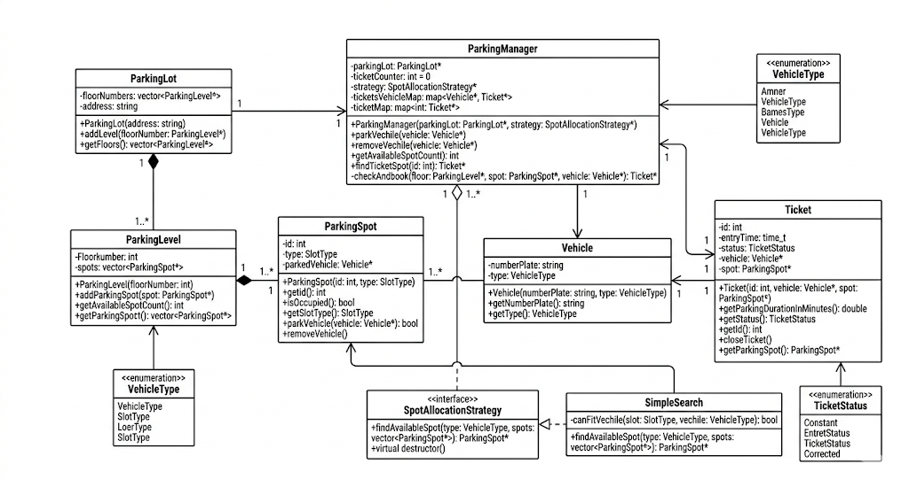

# Parking Lot Design


## Flow

1. Clarify scope
2. Define functional requirements
3. Define non-functional requirements
4. Identify entities
5. Identify relationships
6. Identify responsibilities
7. Design classes/interfaces
8. Design interactions/workflows
9. Handle extensibility
10. Discuss tradeoffs

## Functional Requirements
1. Parking lot has multiple levels.
2. Each level has multiple parking spots.
3. Different spot types:
   1. small
   2. medium
   3. large
4. Vehicle enters parking lot.
   1. bike
   2. car
   3. truck
5. System finds a suitable spot.
6. Ticket generated.
7. Vehicle exits.
8. Spot becomes free.
9. User can view available spots.

## Non-Functional Requirements: Minimal

1. Extensible design
2. Maintainable
3. Object-oriented
4. Basic consistency

## Identify Core Entities

Aim: "Can we convert English nouns into objects?"
Using: Person, Place & Thing

Parking Lot core entities from requirements:

### Good entities:

1. ParkingLot
2. ParkingLevel
3. ParkingSpot
4. Vehicle
5. Ticket

### Then supporting entities:

1. VehicleType
2. SpotType
3. ParkingSpotManager (for orchestration as we can't write all logic in main)


Each entity should represent:

1. real-world concept
2. own state
3. own behavior

Example:

A ParkingSpot:

1. has size/type
2. knows occupied/free state
3. can park vehicle
4. can remove vehicle

That means it deserves a class.


## Relationship

<table>
    <thead>
        <tr>
            <th>Relationship</th>
            <th>Description</th>
            <th>Type</th>
        </tr>
    </thead>
    <tbody>
        <tr>
            <td><b>ParkingLot → ParkingLevel</b></td>
            <td>
                One ParkingLot contains multiple ParkingLevels.
            </td>
            <td><code>Composition</code></td>
        </tr>
        <tr>
            <td><b>ParkingSpot → Vehicle</b></td>
            <td>
                One ParkingSpot may contain one Vehicle at a time.
            </td>
            <td><code>Association</code></td>
        </tr>
        <tr>
            <td><b>Ticket → Vehicle</b></td>
            <td>
                One Ticket belongs to one Vehicle.
            </td>
            <td><code>Association</code></td>
        </tr>
    </tbody>
</table>

## Responsibility
`A class should manage its own state.`

## Flow
1. "Let me first clarify the functional requirements and define the scope."
2. "Let us first build a basic parking workflow. We can later extend it for payment and concurrency."

### ParkingLot

Responsibility:

1. contains levels
2. initializes parking structure

NOT:

1. park vehicle directly

### ParkingLevel

Responsibility:

1. maintain spots
2. check availability on level

### ParkingSpot

Responsibility:

1. park vehicle
2. remove vehicle
3. know occupancy

### Vehicle

Responsibility:

1. vehicle metadata only

### Ticket

Responsibility:

1. entry time
2. assigned spot
3. vehicle info

## UML Diagram



---


## Entities:

We will start by finding minimal entities which represent real-world things or places.

So, using the basic idea from the functional requirements we can see the following entities:

### Vehicle
In a parking lot the main entity is the vehicle, so it will be an entity.
Now, we need minimal data which is specific to this class only.
So those can be stated as:
1. Number Plate
2. Vehicle Type
3. Methods for getting type and plate

Now, here we cannot use string as type, because if we use string now and in the future other types are also supported then we have to modify that in the Vehicle class which violates the `open-closed principle`.
So we create another class `VehicleType` and more specifically it is an enum.

### Parking Spot
After we know that we have a vehicle we should now be able to park it at a spot, so here spot will be an entity. The spot must contain minimal data and the required data for this class.

Therefore the required data for this can be:
1. Id
2. Slot type
3. Parked Vehicle
4. Occupied

Here, `id` is to uniquely identify a spot among others, and vehicles have types like `bike`, `car`, `truck`, so if we support different sizes of slots we can create an `enum` for slot types like `small`, `medium`, `large`.

Now, why do we need a reference to `Vehicle`? It is because we need that to complete the responsibility of a spot. To check whether we need a relation to another object we ask:
`Does this object need to know about another object to perform its responsibilities?`

### Ticket

Ticket should act as a session and must contain:

1. Ticket id
2. Entry Time
3. Vehicle
4. Parking Spot
5. Status

Here, status is added because when we see the lifecycle we get `ACTIVE`, `CLOSED` following:
"What states can this entity be in during its lifecycle?"

### ParkingLevel
This entity is only important when we have multiple floors, as we need a place where we store the parking spots.

Things included in this entity:
1. Level
2. List of Parking Spots
3. Find Available Spot
4. Allocate / Free Spot

### ParkingLot

Now this exists above the levels and contains all the levels.
It contains basic things:
1. Parking Levels
2. Method to add parking levels


### ParkingManager
Now since we have all minimal entities we want to orchestrate and simulate the flow, so for that we will have an orchestration class.

Entities should manage: their `OWN` state.

Manager/service classes should manage: `WORKFLOWS` between entities.

It should orchestrate:
1. Vehicle
2. ParkingLevel
3. ParkingSpot
4. Ticket
5. Strategy


Whenever adding a class we must think in terms of:
"What responsibility should it own?"

### Main

Now here we create each entity and simulate real-life behavior like creating parking spots, vehicles, etc.


## Concurrency

Objective: "Currently this works in single-threaded environment.
Now let us discuss concurrent access handling."


In parking lot:

1. parking spot status
2. available count
3. ticket creation

These are shared mutable states

```
Parking spot allocation is a critical section because multiple threads may try to allocate the same spot simultaneously.

We can protect spot assignment using synchronization mechanisms like mutex locks.
```

### Final

```
Initially I assumed single-threaded execution.

In concurrent scenarios, parking spot allocation becomes a critical section because multiple vehicles may attempt to reserve the same spot simultaneously.

To avoid race conditions, we can synchronize spot allocation using mutex locks.

Instead of locking the whole parking lot, we can lock only a specific spot or level so multiple vehicles can park at the same time without conflicts.

```