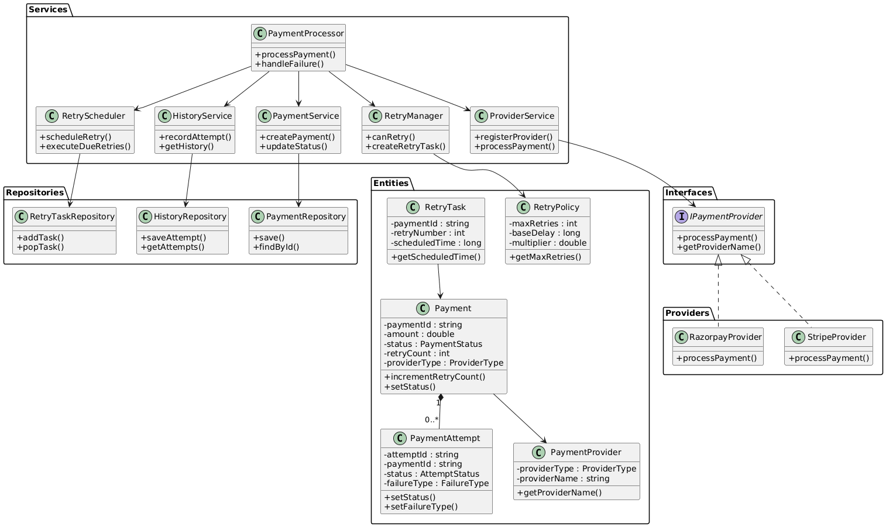

# Payment Retry Mechanism


## Problem


A customer attempts to make a payment. The payment request is sent from our system to an external payment gateway. In the real world, payment gateways are not perfectly reliable. Sometimes they become temporarily unavailable, network calls fail, requests timeout, load balancers drop connections, internal services crash, or a response is lost while travelling back to our server. These failures may happen even when the customer's bank account has sufficient balance and the payment could eventually succeed if retried after some delay.


We need a payment processing system that communicates with an external payment gateway. When transient failures occur, the system should automatically recover through controlled retries. The system must ensure that customers are never charged multiple times, must handle uncertain outcomes safely, must avoid retry storms during outages, must maintain complete payment history, and must eventually reach a final consistent payment state.


## Gathering Requirements


The purpose of requirement gathering is to define the scope of the system before writing any design or code.


1. Three retry attempts.

2. Exponential backoff.

3. Random jitter.

4. Retry only temporary failures.

5. Store complete retry history.

6. Support multiple payment providers.

7. One retry worker.

8. Thread-safe design.


### Functional Requirements


These are the features the system must provide.


#### Create Payment


System receives a payment request. It creates a payment with a unique ID. Initially its status is PENDING.


#### Process Payment


The system sends the payment to the selected provider. Provider returns success or failure. Payment status is updated accordingly.


##### Support Multiple Providers


System should work with different payment gateways.


For example: 


Stripe, Razorpay, PayPal


Tomorrow another provider can be added without changing existing code.


#### Retry Temporary Failures


Not every failure should be retried.


Examples of retryable failures


1. timeout

2. network failure

3. server unavailable

4. gateway busy

5. connection reset


Examples of non-retryable failures


1. invalid card

2. card expired

3. insufficient balance


Retrying these wastes resources.


#### Maximum Retry Count


Retry only three times. After that, mark payment as permanently failed.


#### Exponential Backoff


Do not retry immediately. Increase waiting time after every failure.


Example

```

Retry 1 → wait 1 second


Retry 2 → wait 2 seconds


Retry 3 → wait 4 seconds

```

This prevents overloading the provider.


#### Random Jitter


Suppose 100,000 payments fail because Stripe goes down.


Without jitter, every payment retries exactly after 1 second.


The provider suddenly receives 100,000 requests together. This creates another outage. Instead, add a small random delay.


Example


Instead of exactly 2 seconds retry after


```

1.8

2.1

2.3

2.5

```

seconds.


The requests spread naturally. This is called jitter.


It avoids a retry storm.


#### Maintain Retry History


Every attempt should be stored.


Example

Attempt 1:
```

Time

Provider

Failure reason

Latency

Response code

Result

```


#### Final Payment Status


At the end, payment must be one of: `[SUCCESS, FAILED]`


No payment should remain halfway forever.


#### Payment Idempotency


If the same payment request comes twice, system should not charge twice.


`Same payment ID -> Return existing result`.


Do not create another payment.


#### Provider Response Recording


Store

```

provider transaction ID

response code

error message

timestamp

latency

```


#### Retry Scheduling


After failure, payment should be scheduled for future retry. It should not block the current thread by sleeping. The scheduler decides when the next retry happens.


#### Query Payment


Client should be able to ask

```

Current status

Retry count

Retry history

Provider used

Final result

```


### Non-Functional Requirements


These describe how the system should behave rather than what it does.


#### Reliability


A retry should never be lost.


If the application crashes after scheduling a retry, a production system would recover and continue later. 


#### Scalability


Thousands of payments may be processed at the same time.

Retry mechanism should work independently for every payment.


#### Extensibility


Adding a new provider should require adding a new implementation rather than modifying existing processing logic.


#### Maintainability


Retry logic, provider logic, history, scheduling, and storage should each have a clear responsibility so they can be tested and modified independently.


#### Thread Safety


If multiple worker threads process payments, only one worker should retry a particular payment at a time. Shared state such as payment status and retry count must be protected from race conditions.


#### Performance


The system should avoid unnecessary retries, avoid blocking worker threads, and calculate retry delays efficiently.


#### Observability


Every retry attempt, delay, provider response, and final outcome should be logged or recorded so failures can be diagnosed later.


#### Configurability


Values such as maximum retry count, base delay, maximum delay, and jitter range should come from configuration rather than being hardcoded.

## UML-Diagram

<p align="center">
    
</p>


## Use Case


The purpose of this stage is to divide the system into logical business feature or workflow.


### Payment Management


Responsible for the lifecycle of a payment.


```

Create Payment

Process Payment

Update Status

Get Payment Details

Get Payment Status

```

Everything related to the payment itself belongs here.


### Provider Management


Responsible for talking to payment gateways.

```

Select Provider

Send Payment Request

Receive Provider Response

Handle Provider Errors

```

Provider-specific logic stays isolated here.

Tomorrow a new provider can be added without affecting retry logic.


### Retry Management


Responsible for deciding whether and how to retry.

```

Check Retry Eligibility

Increase Retry Count

Calculate Retry Delay

Apply Exponential Backoff

Apply Jitter

Stop After Maximum Retry

```

It only decides when and whether another attempt should occur.


### Retry Scheduling


Responsible for executing retries at the correct time.

```

Schedule Retry

Execute Scheduled Retry

Remove Completed Retry

```

This module manages time.

It does not know anything about payment providers.


### History Management


Responsible for recording every attempt.

```

Record Attempt

Store Failure Reason

Store Success Details

Retrieve Retry History

```

Customer support and debugging depend on this information.


### Status Management


Responsible for maintaining the current state.

```

Pending

Processing

Retry Pending

Success

Failed

```

Every workflow updates status through this module rather than modifying it arbitrarily.

## Entities

The goal of this stage is to identify what data the system needs to remember.

If the application restarts and you would want that information back, it is probably an entity.


### Payment

The main business object.

Stores everything related to one payment.

Typical fields
```
paymentId
amount
currency
status
providerId
retryCount
nextRetryTime
createdAt
updatedAt
idempotencyKey
```
### PaymentAttempt

Represents one attempt to process a payment.

A payment can have many attempts.

Typical fields
```
attemptNumber
paymentId
providerId
status
failureReason
responseCode
providerTransactionId
latency
attemptTime
```
This is your retry history.

### PaymentProvider

Represents a payment gateway.

Typical fields
```
providerId
providerName
isAvailable
```
Concrete providers (Stripe, Razorpay, etc.) will later implement the provider interface.

### RetryPolicy
Represents configurable retry settings.

Typical fields
```
maxRetries
baseDelay
maxDelay
backoffMultiplier
jitterEnabled
jitterRange 
```
Keeping these together avoids scattering configuration throughout the code.

### ScheduledRetry

Represents a payment waiting to be retried.

Typical fields
```
paymentId
scheduledTime
attemptNumber
```
The scheduler works with these tasks instead of scanning every payment repeatedly.

## Relationships

Once the entities are identified, the next step is to determine how they are connected. A relationship tells us which object knows about another object and how many of them can exist.

### Payment → PaymentAttempt

Relationship: Composition
Cardinality: 1 to N

### Payment → PaymentProvider

Relationship: Association
Cardinality: N to 1

### RetryTask → Payment

Relationship: Association
Cardinality: 1 to 1

### RetryPolicy → Payment

Relationship: Association
Cardinality: 1 to N


## Responsibilities

### PaymentService

Owns the payment lifecycle.

Responsibilities
```
Create Payment
Get Payment
Update Payment Status
Increase Retry Count
Save Payment
Validate Payment Request
```

### ProviderService

Owns communication with payment gateways.

Responsibilities
```
Select Provider
Call Provider
Receive Provider Response
Convert Provider Response into Common Result
```
### RetryManager

Owns retry decisions.

Responsibilities
```
Check Retry Eligibility
Check Maximum Retry Limit
Identify Retryable Failure
Calculate Next Retry Delay
Apply Exponential Backoff
Apply Jitter
Create Retry Task
```
Everything related to retry rules belongs here.

### RetryScheduler

Owns time.

Responsibilities
```
Schedule Retry
Execute Retry
Remove Completed Retry
Fetch Due Retry Tasks
```


### HistoryService

Owns retry history.

Responsibilities
```
Create Attempt Record
Store Failure
Store Success
Get Payment History
```
HistoryService only manages PaymentAttempt.

### PaymentProcessor

This is the orchestrator. It coordinates all services.

Responsibilities
```
Start Payment Processing
Call Provider
Handle Success
Handle Failure
Trigger RetryManager
Record History
Update Final Status
```

### Payment

Responsibilities
```
Store Payment Information
Store Current Status
Store Retry Count
Store Provider Reference
```
No business logic.

### PaymentAttempt

Responsibilities
```
Store Attempt Information
Store Failure Reason
Store Provider Response
Store Timestamp
```

### RetryPolicy

Responsibilities
```
Store Retry Configuration
```
No calculations.

### RetryTask

Responsibilities
```
Store Scheduled Retry Time
Store Payment Reference
```
### PaymentProvider

Responsibilities
```
Store Provider Metadata
```
Concrete provider implementations perform processing.


## Classes

### Payment
#### Data Members

```
string paymentId;
double amount;
string currency;
PaymentStatus status;
int retryCount;
string idempotencyKey;
PaymentProvider* provider;
long createdAt;
long updatedAt;
```
#### Methods
```
getPaymentId()
getAmount()
getStatus()
setStatus()
incrementRetryCount()
getRetryCount()
setProvider()
getProvider()
updateTimestamp()
```

### PaymentAttempt
#### Data Members
```
string attemptId;
string paymentId;
int attemptNumber;
AttemptStatus status;
string failureReason;
string providerTransactionId;
string responseCode;
long latency;
long attemptTime;
```
#### Methods
```
getAttemptNumber()
getStatus()
setStatus()
setFailureReason()
setResponse()
setLatency()
```
### PaymentProvider
#### Data Members
```
string providerId;
string providerName;
bool available;
```
#### Methods
```
getProviderId()
getProviderName()
isAvailable()
```
### RetryPolicy
#### Data Members
```
int maxRetries;
long baseDelay;
long maxDelay;
double multiplier;
bool jitterEnabled;
int jitterPercentage;
```
#### Methods
```
getMaxRetries()
getBaseDelay()
getMultiplier()
isJitterEnabled()
```
### RetryTask

#### Data Members
```
string paymentId;
int retryNumber;
long scheduledTime;
```
Methods
```
getPaymentId()
getScheduledTime()
getRetryNumber()
```
### Interface
### IPaymentProvider

Responsibilities

Every provider must process payments in the same way.

Methods
```
processPayment(Payment*)
getProviderName()
```
Concrete Providers

StripeProvider

Methods
```
processPayment()
getProviderName()
```
RazorpayProvider

Methods
```
processPayment()
getProviderName()
```

Service Classes

### PaymentService

Owns Payment.

#### Data Members
```
PaymentRepository*
```
#### Methods
```
createPayment()
getPayment()
updateStatus()
incrementRetryCount()
savePayment()
```

### ProviderService

Owns provider selection.

#### Data Members
```
vector<IPaymentProvider*>
```
#### Methods
```
registerProvider()
getProvider()
processPayment()
```
### RetryManager

Owns retry rules.

#### Data Members
```
RetryPolicy
RetryScheduler*
```
#### Methods
```
canRetry()
isRetryableFailure()
calculateDelay()
applyJitter()
scheduleRetry()
```
### RetryScheduler

Owns scheduling.

#### Data Members
```
RetryTaskRepository*
```
#### Methods
```
addRetryTask()
executeDueRetries()
removeRetryTask()
```
### HistoryService

Owns retry history.

#### Data Members
```
HistoryRepository*
```
#### Methods
```
recordAttempt()
getHistory()
```
### PaymentProcessor

This is the workflow coordinator.

#### Data Members
```
PaymentService*
ProviderService*
RetryManager*
HistoryService*
```
#### Methods
```
processPayment()
handleSuccess()
handleFailure()
```
This class contains the complete payment workflow.

### PaymentRepository

#### Data Members
```
unordered_map<string, Payment*>
```
#### Methods
```
save()
find()
exists()
remove()
```
### HistoryRepository

#### Data Members
```
unordered_map<string, vector<PaymentAttempt*>>
```
#### Methods
```
saveAttempt()
getAttempts()
```
### RetryTaskRepository

#### Data Members
```
priority_queue<RetryTask*>
```
A priority queue is ideal because retries should be processed in chronological order based on their scheduled execution time.

#### Methods
```
addTask()
getNextTask()
removeTask()
isEmpty()
```


## Compile

```bash
g++ -std=c++17 main.cpp $(find src -name "*.cpp") -Iinclude -o payment
```

## Run

```bash
./payment
```