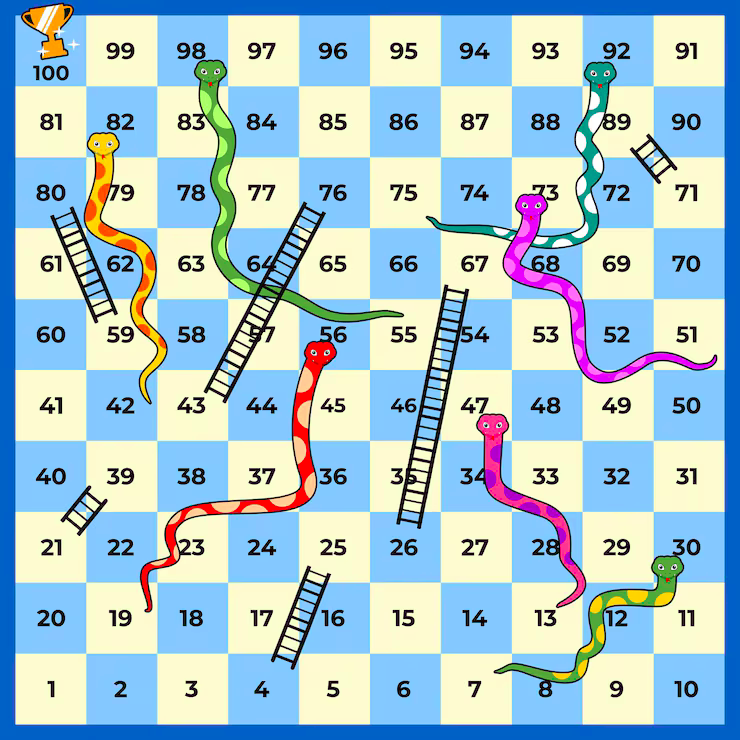
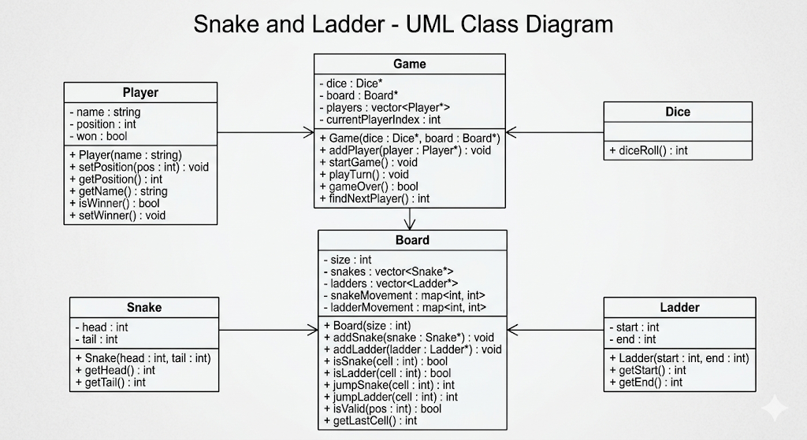

# Snakes and Ladders

The following approach is used while designing the system:

1. Understand the problem
2. Gather minimal requirements
3. Define entities
4. Define responsibilities
5. Define interactions
6. Design classes/interfaces
7. Walk through the flow
8. Discuss possible extensions

---

# Understanding the System

Snake and Ladder is a classic turn-based board game played by two or more players on a numbered grid, typically from 1 to 100.

Each player starts from cell 1 and takes turns rolling a dice. Based on the dice value, the player moves forward on the board.

The game contains:

1. **Ladders** — move the player upward to a higher cell
2. **Snakes** — move the player downward to a lower cell

The first player to reach the final cell wins the game.

In our implementation:

* The board contains 100 cells
* The board contains snakes and ladders
* Players start from cell 1
* A player rolls the dice and moves forward
* If the player lands on a snake head, the player moves downward
* If the player lands on a ladder start, the player moves upward

---

# Functional Requirements

## Core Gameplay Flow

1. The game starts
2. Players are initialized
3. The board contains snakes and ladders
4. The current player rolls the dice
5. The player moves forward
6. If the player lands on a ladder, the player climbs upward
7. If the player lands on a snake, the player moves downward
8. The winning condition is checked
9. The turn switches to the next player
10. The process repeats until the game ends

---

## Game Rules

1. The dice generates a random value from 1 to 6
2. A player cannot move beyond the board size
3. A snake moves the player downward
4. A ladder moves the player upward
5. The winning condition may require exact landing on the final cell
6. Multiple players are supported
7. The design should support extension for multiple dice in the future

---

## Entity Interactions

1. Player interacts with Dice
2. Game interacts with Board
3. Board manages snakes and ladders
4. Game updates player positions and manages turns

---

# Non-Functional Requirements

1. The design should be extensible
2. New board rules or dice types should be easy to add
3. Responsibilities should remain properly separated
4. The system should be modular and maintainable

---

---

# Entities

In the Snake and Ladder game, the main entities are:

* Game
* Player
* Board
* Snake
* Ladder
* Dice

The `Game` entity acts as the orchestrator and manages the overall game flow.

---

## Player

Represents a player participating in the game.

### Attributes

1. Id
2. Name
3. Position
4. Winner status

### Responsibilities

1. Store current position
2. Update player position
3. Track whether the player has won

---

## Board

Represents the game board.

### Attributes

1. Size
2. Snakes
3. Ladders

### Responsibilities

1. Store snakes and ladders
2. Validate player movement
3. Determine final position after snake or ladder movement

---

## Snake

Represents a snake on the board.

### Attributes

1. Head
2. Tail

### Responsibility

1. Move the player downward

---

## Ladder

Represents a ladder on the board.

### Attributes

1. Start
2. End

### Responsibility

1. Move the player upward

---

## Dice

Represents the dice used in the game.

Dice is responsible for generating random values. Even though it mainly handles randomness, it is modeled as a separate entity because the system can later support multiple dice or different dice behaviors.

---

---

### Responsibilities

1. Generate random values
2. Support extensibility for custom dice behavior

---

## Game

The `Game` entity acts as the orchestrator of the system.

It controls:

* player turns,
* game flow,
* dice rolling,
* movement updates,
* and winner detection.

### Attributes

1. Players
2. Board
3. Dice
4. Current player index
5. Game state

### Responsibilities

1. Start the game
2. Manage turns
3. Coordinate player movement
4. Check winning conditions
5. End the game
