# Mediator Design Pattern

The Mediator Design Pattern is a behavioral design pattern used to control and simplify communication between multiple objects.

Instead of objects communicating directly with each other, all communication happens through a central object called the Mediator.

## Why This Pattern Exists

#### Without mediator:

    1. Every object knows about many other objects.
    2. Objects become tightly coupled.
    3. Changes in one object affect many others.
    4. Communication logic becomes scattered everywhere.

#### With mediator:

    1. Objects only know the mediator.
    2. Communication is centralized.
    3. Objects become loosely coupled.
    4. Easier maintenance and scalability.

<h3>Mediator Class Diagram</h3>

<h3>Mediator Sequence Diagram</h3>

## Limitations
#### Mediator Can Become a God Object

This is the biggest limitation.

As system grows:

1. more components
2. more events
3. more workflows
4. more conditions

all logic gets pushed into mediator.

#### Tight Coupling To Mediator

Mediator reduces: object-to-object coupling

BUT introduces: object-to-mediator coupling

Every component depends heavily on mediator.