# Overview

Prototype design pattern help in solvinf problem where we have an existing object and we want to create a similar obect, but the object creating is long process. Here instead if creating new object everytime even when we have similar object, we can use exiting object to create a clone and we cn chnage some property of that clase as required.

Here, the object whi we will clone has a function which uses copy constructor.

### <h3>Mediator Class Diagram</h3>




## Copy Constructor

It is a special type of constructro in C++, which is used to create a new object from exiting object,

Here we copy the data member of one object into another object.

### Syntax

`ClassName(const ClassName& other);`
Reference is used so we won't invoke infinite recursive copying.

### Invoking Copy Constructor

1. Object Initialization
    Student s2 = s1; or Student s2(s1);
2. Pass Object by Value
    ```cpp []
    void print(Student s) {

    }
    ```
3. Return Object by Value
    ```cpp []
    Student getStudent() {

        Student s;
        return s;
    }
    ```

When we don't create a copy constructor, compiler provides a default copy constructor.

Their are 2 types of coppy constructor.
1. Shallow Copy
2. Deep Copy

When an object creation contains dynamicaaly aloocated memeory like in constructor we may have `arr = new int[10]`. Than when we don't create a manuall copy contructor shallow copy wil happe and both objects will point to same memery location for the dynamically allocated data.
Therefore in deep copy we reallocate the heap data.

#### Deep Copy
```cpp []
#include <iostream>
using namespace std;

class Test {

public:

    int *data;

    Test(int value) {

        data = new int(value);
    }

    Test(const Test& other) {

        data = new int(*(other.data));
    }

    void print() {

        cout << *data << endl;
    }

    ~Test() {

        delete data;
    }
};

int main() {

    Test t1(10);

    Test t2 = t1;

    *(t2.data) = 20;
    
    t1.print();
    t2.print();

    return 0;
}
```
Every non-static member function gets hidden pointer: `"this"`

#### Copy Assignment Operator
```cpp []
#include <iostream>
using namesoce std;

class Student {

public:

    int age;

    Student(int a) {

        age = a;
    }

    Student& operator=(const Student& other) {

        age = other.age;

        return *this;
    }

    void print() {

        cout << age << endl;
    }

};

int main() {

    Student s1(10), s2(20);

    s2 = s1; // s2.operator=(s1)

    s2.print();

    return 0;
}
```

If class manually manages resources and defines:

1. destructor
2. copy constructor
3. copy assignment operator

then usually all three should exist together.

