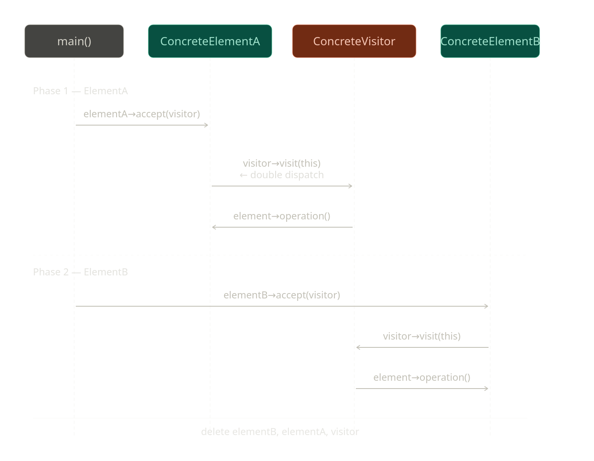

# Overview

When we already have existing object classes and new requirements keep getting added, we may need to support many new operations for those objects. If we keep adding all these methods directly inside the object classes, then the classes must be modified again and again for every new feature. Over time, the classes become very large and difficult to maintain.

The Visitor pattern solves this problem by moving operations that are not core responsibilities of the object into separate visitor classes.

The object only accepts a visitor, and the visitor performs the required operation on the object. This allows us to add new operations without modifying the existing object classes.

### <h3>Visitor Sequence Diagram</h3>

